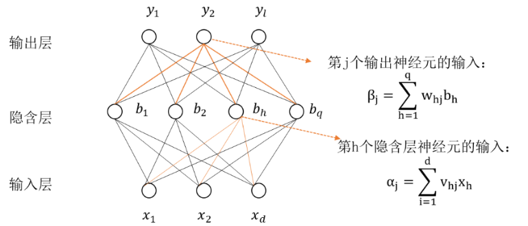

```{r setup, echo=F}
knitr::opts_knit$set(root.dir = getwd())
knitr::opts_chunk$set(echo = FALSE, results = 'hide')
knitr::opts_chunk$set(warning = FALSE, message=FALSE)
knitr::opts_chunk$set(fig.pos = 'H')
```

```{r prepare}
rm(list=ls())
options(digits=4)
options(scipen=100)
graphics.off()
Sys.setlocale("LC_ALL", "Chinese")
```

**摘要：** 本文在对中国碳排放交易市场碳交易价格形成机制讨论的基础上，提出了预测
指标体系，收集了2017年1月1日至2018年9月30的广东碳交易市场碳交易价格数据和指标体
系中各预测变量的数据，使用Lasso回归方法对变量进行筛选，建立灰色BP神经网络对碳交
易价格进行预测。预测模型在对于不超过10期短期预测平均相对绝对误差(MAPE)小于4%，预
测精度较高。

**关键词：** 碳交易价格； Lasso回归； 灰色模型； BP神经网络；预测

**Abstract:**

**Key Words:**

# 简介
[//]: # 问题界定，文献综述，文章结构简述

近几年来，全球极端天气频繁发生，全球平均气温升温超过1℃，这与全球碳排放量与日俱
增密切相关。若任由形势继续发展下去，必将严重威胁人类的生存与发展。中国作为全球最
大的温室气体排放国，为应对全球气候变化，我国已经和175个国家签署了《巴黎气候协定》，
并在多次政府工作会议中指出要加快推动碳市场的建设和碳金融的发展。碳排放交易市场的
建设是控制温室气体排放的重大创新举措，是我国生态文明建设的重点目标之一。但我国碳
排放交易（以下简称碳交易）市场的建立起步较晚，在经历了4年地区试点探索后，2017年
12月19日我国碳排放交易系统正式启动。当下我国正处于全面建设碳排放交易市场的初级阶
段，处于全球碳交易链条的底端，国际话语权不足，同时市场机制尚未完善，其发展仍然存
在很多制约因素，而价格作为调节碳交易市场的经济手段，研究其影响因素的作用机理和预
测价格变动规律，对于深入了解碳市场，推进碳交易市场全面健康持久的发展具备重要意义。

我国碳排放交易市场是参照欧盟碳排放权交易体系（EU Emissions Trading System）建立
起来的。欧盟碳交易体系市场机制成熟，运行时间长，当下对欧盟碳交易体系市场价格的研
究成果也相对较多。陈晓红和王陟昀（2012）以欧盟排放交易体系为样本开展研究发现,受
政策和制度影响的配额供给是交易价格最重要影响因素，煤炭价格是最大的能源影响因素，
天气因素影响不明显[@陈晓红2012]。Aatola(2013)研究欧盟碳排放市场发现碳交易期货价
格与电力价格、能源价格存在强相关性[@Aatola2013Price]。Deeney(2016)采用事件分析法
探究了欧洲议会的决议对于欧盟碳市场价格波动影响[@Deeney2016Influences]。Tan(2017)
基于分位数回归探究了碳排放价格与能源、经济因素的依赖关系和影响路径，发现前期能源
价格对碳市场冲击影响大，后期工业发展、股票市场因素的影响力逐渐提升
[@Tan2017Dependence]。

与欧盟碳排放市场相比，国内碳交易市场仍处于成长阶段，市场机制尚待完善。在国际市场
已经逐渐形成了以宏观经济、能源市场为主要影响因素，政策因素等其他因素为辅的影响系
统时，我国学者利用当下碳试点地区积累的数据，也纷纷开展了碳排放权价格的研究。王倩
(2015)认为中国碳交易市场需求方起主导地位，能源、气候、经济对碳交易价格的波动有显
著影响[@王倩2015]。赵立祥(2016)研究得出碳交易价格的首要影响因素是市场环境,而政策
和气候环境具备一定的影响，能源价格影响微弱[@赵立祥2016]。樊艳艳(2017)采用稳健的
静态面板回归模型发现煤炭价格波动对碳排放交易价格具备显著影响[@樊艳艳2017]。但这
些研究在选择碳排放价格可能影响因素时，考虑的因素数量相对较少，而且选择的时候主观
随意性较大。随着市场成熟度不断提升，交易者对于碳交易价格波动的变化关注度越来越高，
准确地预测碳交易价格对于市场参与者进行经济决策显得尤为重要。如姚奕等(2017)通过
EMD-SVM模型对湖北碳市场碳交易价格进行了预测并取得较好效果[@姚奕2017]。张晨和杨仙
子（2016）使用灰色马尔科夫模型预测碳价波动[@张晨2016]。胡根华和朱福敏（2018）使
用无穷活动率Levy过程构建了碳价格波动率模型[@胡根华2018]。

随着数据科学和大数据方法的发展，我们可以使用统计变量选择方法来更客观地确定我国碳
排放交易市场价格影响因素指标，还可以使用机器学习的方法更准确的预测碳交易价格。本
文构建指标体系并获取数据后进行数据检验并建立Lasso回归，客观地筛选出影响碳交易价
格的重要影响因子，根据已经筛选的重要预测因子，建立灰色BP神经网络预测模型对预测碳
交易价格进行预测。文章第二部分对碳排放交易市场价格可能存在的影响因素进行讨论，第
三部分对可能的影响因素确定测量变量并收集数据，筛选变量，建立预测模型，进行实证分
析，最后是结论。

# 碳排放交易市场价格影响因素和指标

碳交易价格的形成实际上是在市场经济的条件下，供需双方进行博弈，最终形成均衡价格的
过程。从供给角度看，随着节能减排技术突破难度更大，气候环境形势愈加严峻，碳排放权
供给会逐渐减少，在总需求不变时，碳交易价格将会上升。从需求的角度分析，碳排放权需
求增加主要受到市场基本环境和不确定事件两个方面的影响。其中市场基本环境主要是指受
宏观经济变动、能源价格、气候环境或国际市场的影响从而导致碳排放权的需求增大或减少；
不确定事件主要是指由于政策发布、经济危机或履约期等多种不能预测其影响程度或者发生
时间的一些因素。由于不确定事件具有复杂多变性、不可预测性、不可量化性，所以下面主
要从基本面上开展研究。根据宏观经济变动、能源价格、气候环境或国际市场的影响这四个
基本影响因素分别选取了初步认为对碳交易价格影响较大的指标，并考虑数据可获取性等因
素，本文总结了以下四个方面影响因素及其具体指标。

（一）宏观经济

经济的发展水平直接影响着社会的需求和消费，碳交易系统活动的进行离不开市场经济，宏
观经济的波动必然会给碳交易价格的涨跌带来影响。当经济衰退、市场低迷时，消费者便会
减少消费，企业产量下降，大量资源被闲置，碳排放量需求减少，碳交易价格下跌。经济势
头良好，消费意愿提升，企业扩大生产，资源得以充分利用时，碳排放量需求提高，价格上
升，所以理论上宏观经济的变动与碳交易价格的变动呈正向变动关系。本文选择对国内经济
与绿色金融碳交易市场最为密切的上证180碳效率作为国内企业碳经营效益情况的反映，其
指标含义是基于上市公司的碳足迹数据反映低碳排放公司的绩效表现。对于国内外宏观经济
方面，分别选取了上证指数涨跌幅和道琼斯工业指数涨跌幅作为国内外宏观经济对于国内碳
交易市场冲击的体现。

（二）能源价格

二氧化碳排放的重要源头之一是化石燃料的燃烧。一方面碳排放交易市场通过对成本控制的
方式改变了企业对化石燃料的消耗量。当碳交易价格上涨时，出于对自身生产成本的考量，
企业不得不减少对碳排放权的购买和使用，纷纷减少对碳排放权的需求，化石能源价格也将
因人们对其需求的下降而下降。另一方面，企业可以通过更新技术、改变能源利用方式，提
高能源利用效率，转变传统消耗型经济发展方式，减少化石能源市场的交易，出售碳排放权
获取利益，缓解化石燃料消耗压力大的企业，这些举措都会造成二氧化碳排放量的下降，总
体需求下降，从而影响碳排放权的数量和价格。在能源方面，本文选取了国外原油价格，国
内外煤炭价格，国内外天然气价格作为能源方面的重要因素。原油选择了全球原油的定价基
准德克萨斯原油价格，国外天然气价格选择了与中国联系最为密切的天然气公司公布的埃克
天然气价格，国内天然气选择任丘华港 、内蒙时泰等天然气公司的每日报价的均值，作为
国内天然气价格的体现。纽卡斯尔作为澳大利亚煤炭吞吐量最大的港口，选用其煤炭价格作
为国际煤炭价格的重要表现，国内煤炭价格选择焦炭期货的每日收盘价作为国内煤炭价格的
典型代表指标。

（三）气候环境

气候环境中影响碳交易价格的主导因素之一是温度，当处于极度炎热或极度严寒的环境状态
下时，人们会提高使用制冷设备的频率或增加热力供应需求，能源需求上升，CO2排放增加，
因而碳交易价格也随之变动。另一方面空气中温室气体的含量直接决定着碳交易价格的制定，
近些年来空气污染越来越严重，“三废”的大量排放导致空气质量越来越差，雾霾天气严重。
环保部门制定了空气质量指数(AQI)来测量空气质量等级，AQI较为直观的反映了空气中温室
气体的含量，从而影响碳交易价格的走向。因此，从气候环境的角度，本文主要考虑空气中
碳含量和极端天气对于碳交易价格的影响。对于碳含量，本文选取了各地区的空气质量价格
指数(AQI)作为空气质量的衡量指标，其指标说明了空气中主要污染物的含量。对于极端天
气，本文从天气网爬取了试点地区的日最高、最低温度数据。

（四）国际市场

欧盟是全球碳排放主要需求者，欧盟各国设定一定的配额量，而这个配额量会直接影响各国
对碳排放的需求，核准减排量（CER）的需求主体是发达国家具中有碳排放权缺口的企业，
而供给端便是发展中国家清洁减排机制的企业。供需双方的缺口直接影响了国内碳交易价格，
而核准减排量便是衡量此缺口的重要指标。另一方面由于国内市场和国外市场的差异，汇率
作为衡量不同币种的货币价值，直接影响了国内外碳交易的差价，市场中的交易者偏向价格
更具优势的市场进行买卖碳排放权，从而影响了单个市场的碳交易价格走势。本文选取核准
减排量(CER)作为国际碳交易市场对我国碳交易市场价格变动的影响因子，选取欧元兑换人
民币汇率作为国际市场环境对碳交易价格波动的重要影响因素之一。

上述四个因素及其具体指标和数据来源总结在表 \@ref(tab:tab-1) 中。

```{r tab-1, eval=T, echo=F, results='markup', cache=F}  
tab1 <- read.csv('.\\result\\指标体系明细表.csv')
knitr::kable(tab1, row.names =F, align = "l", caption="指标体系明细表",
      longtable = TRUE, booktabs = TRUE, linesep  = "")
```

上面对当下研究文献中的影响因子进行归纳总结，初步选定了指标，下面先对收集的数据进
行初步处理，然后采用Lasso回归进行变量的筛选，从而避免通过主观确定重要影响因子，
再建立灰色BP神经网络模型进行预测。


# 碳排放交易市场价格预测

## 数据处理和指标筛选

对于碳交易价格，国内八个试点地区中广东省的交易市场最为活跃，因此本文选取全国第一
大、世界第三大碳交易市场广东，作为国内碳交易价格交易的典型示范地区，进行后续碳交
易价格预测的研究。由于国际市场和国内市场交易日期的有所不同，本文剔除了休息日及国
内外15个假期的影响，获取各试点有效交易日数据357天。为避免汇率的影响，本文统一货
币计量单位，分别对国外原油、国外天然气价格、国外煤炭价格以及核准减排量分别用原始
数据乘以汇率计算得到。最后，针对极端天气这一指标，本文采用通用认定当日最高温在
35℃以上称为高温天气，当日低温低于0℃称为低温天气设定虚拟变量，当气温高于35℃或
0℃时，设为1，其余设为0。

在进行Lasso回归变量筛选之前，由于上面变量数据均为时间序列数据，如果序列具有非平
稳性，直接建立回归模型可能会出现伪回归的问题，因此需先对序列进行平稳性检验。平稳
性检验结果如表 \@ref(tab:tab-3) 。结果表明，核证减排量、德克萨斯原油价格、纽卡斯
尔煤炭价格三个变量不平稳，其他变量均平稳。我们对核准减排量、德克萨斯原油价格、纽
卡斯煤炭价格转化为增长率后，再次进行检验，变换后的序列平稳，此时我们命名核准减排
量增长率、德克萨斯原油价格增长率、纽卡斯尔煤炭价格增长率分别为CERChange、
WTIChange、NEWCChange。这时所有变量均为平稳序列，可以建立Lasso回归模型进行变量筛
选。

```{r tab-3, eval=T, echo=F, results='markup', cache=F}
tab3 <- read.csv('./result/平稳性检验.csv')
knitr::kable(tab3, row.names =F, align = "l", caption="平稳性检验和变量选择结果",
             digits=4,
      longtable = TRUE, booktabs = TRUE, linesep  = "")
```

在进行平稳性检验后，下面使用Lasso回归进行变量选择。Lasso方法最先由
Tibshirani(1996)提出，是变量选择的常用方法之一[@Tibshirani1996]。Lasso方法可以用
来克服回归问题中所遇到的由于模型建立包含所有变量而导致模型的复杂度上升，解释能力
下降的问题。Lasso的系数$\hat{\beta }_{j}^{L}$通过求解下列公式的最小值得到：

$$\sum_{i=1}^{n}\left(y_i-\beta_0-\sum_{j=1}^p\beta_j x_{ij}\right)^2+\lambda\sum_{j=1}^p|\beta_j|
  =RSS+\lambda\sum_{j=1}^p|\beta_j|$$

其主要原理是通过对惩罚项限定区域的设定，当调节参数不断增大时，$\lambda_{1}$将
${{\beta }_{j}}$向0压缩，当调节参数达到某种程度时，${{\beta }_{j}}$压缩为0，从而
完成变量选择，使得重要变量得以凸显。同时在控制$\sum_{j}^{p}|\beta_j|$大小的限制
下，尽可能的寻找使得残差平方和最小的系数。调节参数$\lambda$的选择可以通过交叉验
证的方法得到。其主要思想是通过将观测集随机分为 $k$ 个大小基本一致的组，第一组为
验证集，剩下 $k-1$ 组上拟合模型，整个过程会得到 $k$ 个测试误差，
$MSE_{1},MSE_{2},\cdots,MSE_{k}$,从而得到交叉验证误差
$CV_{(k)}=\frac{1}{k}\sum_{i}^{k}MSE_{i}$ 。从而通过选择一系列 $\lambda$ 的值，
计算其对应的交叉验证误差，然后选择 $CV$ 最小的参数，从而得到最优的调节参数，完成
对模型的拟合。

根据上述Lasso原理我们将初始选取的指标进行标准化处理，以避免量纲影响惩罚项的大小。
本文根据R语言lars包Lasso方法完成变量的选择，并采用10段交叉法选择最为合适的调节参
数。其中我们发现 $CV_{(75)}=0.9033$ ，为最小交叉验证误差，根据针对共线性问题的最
小角度回归原理对变量进行压缩，得到的结果显示在表 \@ref(tab:tab-3) 中，其中上证指
数涨跌幅、道琼斯指数涨跌幅、德克萨斯原油增长率及纽卡斯尔煤炭价格增长率的系数压缩
至0，总计剔除4个变量，剩余8个重要指标。


## 碳交易价格预测

下面根据变量选择结果建立灰色BP神经网络模型进行预测。灰色BP神经网络模型是灰色预测
模型和BP神经网络组合形成的预测方法，综合了灰色模型预测未来变化趋势定性分析的特点
和BP神经网络适用于非线性的样本定量分析的优点。灰色预测是通过少量的不完全的信息对
未来一段时间的值进行预测，其适用于趋势较为明显的数据预测。BP神经网络模型通过构建
由多个非线性的简单单元组成的并行互联的网络，可以有效地对非线性的数据样本的分析，
同时灰色预测模型解决了BP神经网络输入层随机的问题，两者的结合可以有效的完成一定时
间范围内的预测问题。

### 预测变量的灰色模型预测

设重要影响因子 $X^{(0)}$为一单调非负的时间序列。首先，需要采用一次累加的方式弱化
原始序列的随机性得到序列 $X^{(1)}$ ，对 $X^{(1)}$ 建立下列一阶线性微分方程：

$$\frac{\rm dX^{(1)}}{\rm dt}+\alpha X^{(1)}= u$$ {#eq:model1}


得到灰色模型 $GM(1,1)$ ，求解预测值：

$$\hat X^{(1)}(k+1)=\left [\hat X^{(1)}(0)-\frac{\hat \mu}{\hat \alpha}\right] e^{-{\hat \alpha}k}+\frac{\hat \mu}{\hat \alpha}$$ {#eq:model2}


由于在模型预测的过程中我们进行了累加处理，所以若需要得到真实的预测值，则需要进行
累减处理，将 $GM(1,1)$ 模型所得数据 $\hat X^{(1)}(k+1)$ 进行累减还原为 $\hat
X^{(0)}(k+1)$ ，则：

$$\hat X^{(0)}(K+1)=(e^{-\hat \alpha}-1)\left[X^{(0)}(n)-\frac{\hat \mu}{\hat \alpha}\right]e^{{-\hat \alpha} k}$$ {#eq:model3}

由上述步骤可以得到序列的预测结果，但预测结果的准确性需要我们对比后验差模型精度表
来进行衡量。通过计算原始序列 $X^{(0)}$ 和残差的方差之比 $C$ 即后验差比，来判别模
型的预测精度, $C$ 值越小表明预测值和实际的差异越小。根据后验差检验判别表得知，当
$C$ 小于 $0.35$ ，表明模型拟合效果好, $C$ 值在 $0.35-0.5$ 之间，模型拟合效果为
“合格”，$C$ 值在 $0.5-0.65$ 之间，模型拟合效果为“基本合格”，$C$ 值大于
$0.65$ ,说明拟合效果差，需要采用其他方法进行预测。

为尽可能避免由于随机因素对灰色预测模型带来的误差的影响，本文对不同的解释变量采用
了不同的预测过程，对空气质量指数、国内煤炭价格及天然气价格采用直接建立灰色预测模
型；对于碳效率变动率、国际碳交易价格变动率及汇率变动率采用预测原始序列后，利用变
动率公式进行计算得到；对于极端天气这一虚拟变量采用分别预测日最高温和日最低温，然
后根据极端天气的规则进行判别是否处于极端天气中。因自变量较多，下面以空气质量指数
(AQI)变量为例，说明灰色预测的过程。求解微分方程得到预测模型：

$$\hat{X}^{(1)} (k+1)=[\hat{X}^{(1)}(0)+\frac{82.27}{0.002}] e^{0.002k}-\frac{82.27}{0.002}$$ {#eq:model5}

由于GM(1,1)模型得到的是一次累加量，将GM(1,1)模型所得数据 $\hat{X}^{(1)}(k+1)$ 经过累减
还原为 $\hat{X}^{(0)}(k+1)$ ,即 $X^{(0)}$ 的灰色预测模型为：

$$\hat{X}^{(k+1)}=(e^{0.002}-1)[X^{(0)}(n)+\frac{82.27}{0.002}]e^{0.002k}$$ {#eq:model6}

并计算模型预测的残差平方和、平均相对误差及相对精度的值分别为43275.95，29.67%，
70.33%，由此计算后验差比值C值为0.64，判断其预测精度为基本合格。

同理得到其他预测变量未来10期的预测值，结果如表 \@ref(tab:tab-6) 所示。未来10期空
气质量指数、煤炭价格呈下降趋势，但中间有波动，日最高温、国际国际天然气价格、国内
天然气价格呈上升趋势，而国际碳交易价格增长率、碳效率指数变动率及汇率变动率保持稳
定，其水平分别维持在0.29,-0.65,0.34。从各影响因素的预测结果发现空气质量指数、日
最高温和国际天然气价格受随机影响因素影响较大，预测精度较其他影响因素较小，误差较
大。而国际碳交易价格变化率、碳效率指数变化率及汇率变动率预测效果较好。

```{r tab-6, eval=T, echo=F, results='markup', cache=F}
tab6 <- read.csv('./result/灰色预测模型碳价影响因素精度表.csv')
knitr::kable(tab6, row.names =F, align = "l", caption="灰色预测模型碳交易价格影响因素精度表",
      digits=2,
      longtable = TRUE, booktabs = TRUE, linesep  = "")
```

### 灰色BP神经网络预测模型

当灰色预测过程解决了传统BP神经网络输入层所存在的随机性的问题后，我们可以根据传统
BP神经网络模型的模拟过程建立神经元的输入输出关系模拟出碳排放权市场中重要影响因子
与碳排放权价格之间的复杂关系。输入层输入重要影响因子，经过隐含层的处理后输出预测
结果，即我们所需要的碳交易价格的预测结果。

```{r fig-network,eval=T, echo=F,fig.cap="BP神经网络算法示意图",out.width="90%",fig.align="center",dev="png",results='markup', cache=F}

```

BP神经网络的基本思想如图 \@ref(fig:fig-network) 所示，其具体的实现过程如下：

1. 数据输入。在 $(0,1)$ 范围内随机初始化网络中所有节点的连接权 $w_{ij}$ 和节点的阈值 $θ_{ij}$ ,
读入经过标准化处理的重要影响因素的样本 $x_k$ 和碳排放交易价格 $y_k$ ；

2. 模型训练。据已知参数计算当前的碳排放交易价格 $\hat y_k$ ，并计算出输出层神经元的梯度项 $g_j$ 
和隐层神经元的梯度项 $e_h$，计算各层神经元节点的误差信号，反向传播误差，修正权值和阈值；

3. 输出预测值。计算误差，重复上述步骤，直到达到要求的误差范围输出。

由于神经网络具有较强的适用性和容错能力，对历史数据建立训练模型，把灰色预测的数据
结果带入训练好的模型中，就可以得到充分考虑历史信息的预测结果。在对数据进行标准化
的基础上，利用已有样本357期数据进行神经网络模型的训练，其参数设置为误差参数为
$10^{-7}$ ，学习次数10000次，神经元的个数为显著影响碳交易价格变动的变量的数据8个，
经过480次迭代后收敛于82.55，得到预测模型。在使用模型进行预测之前，需对模型的预测
能力进行评估。

为了评估模型的预测精度需要量化误差，平均绝对相对误差(MAPE)不仅仅考虑预测值与真实
值的误差，还考虑了误差与真实值之间的比例，所以本文采用MAPE衡量预测方法预测的准确
性，一般认为MAPE小于10%，则模型的拟合精度较高。我们以2017年1月1日至2018年6月30日
为训练集，以2018年7月1日-2018年9月30日为测试集，预测了未来60期的碳交易价格，灰色
BP神经网络组合预测模对碳交易价格预测并计算MAPE值，具体结果如图 \@ref(fig:fig4)
所示。

```{r fig4,eval=T, out.width="100%", echo=F,fig.cap="预测模型平均绝对百分误差图",dev="png",results='markup', cache=F, fig.height=3}
accuracy <- read.csv("./data/MAPE.csv",header =T,sep=",")
par(mar=c(5,5,2,2)+0.1, oma=c(0, 0, 0, 0))
plot(accuracy[,1],type="o",ylim=c(0,10),
     xlab="预测期",ylab="MAPE(%)",lty=1,cex.lab=0.8,cex.axis=0.7,pch=20,lwd=1.5,cex=0.7)
```

从图 \@ref(fig:fig4) 可以看出，灰色预测模型方法的误差随着预测期的增加呈现出逐渐
增大。在10期内，MAPE小于4%，预测效果较好。对于较长时期，MAPE均在8%以下，中长期预
测效果尚可。下面根据预测模型对未来10期进行预测，具体预测结果如表
\@ref(tab:tab-7) 所示。从图 \@ref(fig:fig1) 得知， 基于灰色BP神经网络的碳交易价
格预测对于波动点的捕捉比较准确，且能够拟合出数据的波动，但从图中得知神经网络的拟
合效果在某些区域表现不佳，准确性相对较低。

```{r tab-7, eval=T, echo=F, results='markup', cache=F}
tab7 <- read.csv('./result/神经网络预测结果.csv')
knitr::kable(tab7, row.names =F, align = "l", caption="神经网络预测结果",
             digits=2,
      longtable = TRUE, booktabs = TRUE, linesep  = "")
```

```{r fig1,eval=T,fig.align="center",out.width="100%", echo=F,fig.cap="灰色BP神经网络预测结果",dev="png",results='markup', cache=F, fig.height=4}
## setwd("E:/paper&project/paper/journal/carbon-emission")
library(data.table)
Data <- read.csv("./data/guangdong.csv",header = T,sep=",")
setcolorder(Data,c("AQIIndex","ClosePrice","Europe_change","Global_GasPrice","Eco_rmb","JDWeather","cer_rmb_diff","TAN180_Change","Deal"))
#network
predict_nnet <- read.csv("./data/predict_nnet_61.csv",header = T,sep=",")
predict_nnet <- as.vector(predict_nnet$V1)

par(mar=c(5,5,2,2)+0.1,oma=c(0, 0, 0, 0))
plot(predict_nnet[1:367],lty=1,type="o",pch=20,xlab="日期",ylab="碳价/元",xaxt="n",cex=0.9,
     cex.lab=0.8,cex.axis=0.7,ylim=c(11,19), lwd=1, col="red")
points(Data[1:357,9],lty=1,type="l",lwd=1,pch=4, cex=0.5)
axis(1,at=c(1,50,100,150,200,250,300,350),labels = c("2017/1/4","2017/3/23","2017/6/9","2017/8/21","2017/11/6",
                                                     "2018/1/7","2018/4/9","2018/6/21"),cex.axis=0.7)
legend(x=295, y=18.5,c("预测值"),pch=c(20), lty=c(1),bty="n",cex=0.7,col="red")
legend(x=290, y=19, c("真实值"),lty=c(1),bty="n",cex=0.7)
```

# 结论

本文对市场中碳交易价格的形成进行分析并建立了指标体系，通过Lasso回归对碳交易价格
的影响因子进行筛选发现，我国碳交易市场价格主要受到煤炭价格、国外天然气价格、汇率、
空气质量指数、国内天然气价格、碳效率指数、极端天气和核准减排量的影响，而国内外宏
观经济、原油价格、国际煤炭价格对国内碳交易价格波动影响微弱。本文还通过对预测变量
进行灰色模型预测建立了灰色BP神经网络模型。灰色BP神经网络模型对于短期碳交易价格的
趋势预测及波动的预测较为准确，误测偏差在短时间内小，但随着预测期的增加，预测精度
下降，预测误差较大。在实际预测的过程中，采用灰色BP神经网络模型进行碳交易价格预测
时，其预测有效期最好控制在10期内，对于中长期预测结果，由于预测误差较大，精度较低，
在使用时必须特别小心。

# 参考文献
[//]: # (\bibliography{Bibfile})

