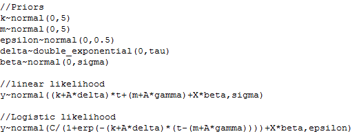

```{r setup, echo=F}
knitr::opts_knit$set(root.dir = getwd())
knitr::opts_chunk$set(echo = FALSE, results = 'hide')
knitr::opts_chunk$set(warning = FALSE, message=FALSE)
```

```{r prepare}
rm(list=ls())
options(digits=4)
options(scipen=100)
graphics.off()
Sys.setlocale("LC_ALL", "Chinese")
```

**TODO**

- [X] 把数据和程序打包
- [X] 图重新画，在生成的word里面图像的字体太小了
- [ ] 把图形位置替换为生成图形的R代码
- [ ] 分成两篇文章：1. 基于灰色BP神经网络碳排放权交易价格预测； 2. 基于Prophet自动预测模型碳排放权交易价格预测

**摘要：** 本文从政府和企业两个角度出发选取国内6个碳交易试点地区作为研究对象，重
点探究了国内碳交易价格的影响因素作用机理及预测问题，结果发现我国正处于受能源价格
影响的初级阶段，宏观经济影响微弱，股市联动性差，并且能源价格呈负向作用，这种负向
作用从煤炭、天然气到原油依次递减；对于碳交易价格的预测问题宜采用灰色BP神经网络进
行短期预测，有效期需控制在15期内，长期预测可采用Prophet模型，其操作的便捷性和可
分解性将为碳市场研究人员带来诸多便利。

# 简介
[//]: # 问题界定，文献综述，文章结构简述

近几年来，全球极端天气频繁发生，平均气温升温超过1℃，这与全球碳排放量与日俱增密
切相关。若任由形势继续发展下去，必将严重威胁人类的生存与发展。中国作为全球最大的
温室气体排放国，为应对全球气候变化，我国已经和175个国家签署了《巴黎气候协定》，
并在多次政府工作会议中指出要加快推动碳市场的建设和碳金融的发展。但我国碳排放交易
（以下简称碳交易）市场的建立起步较晚，在经历了4年地区试点探索后，2017年12月19日
我国碳排放交易系统正式启动。当下我国正处于全面建设碳排放交易市场的初级阶段，处于
全球碳交易链条的底端，国际话语权不足，同时市场机制尚未完善，其发展仍然存在很多制
约因素，而价格作为调节碳交易市场的经济手段，研究其影响因素的作用机理和把握价格变
动规律，对于深入了解碳市场，对于推进碳交易市场全面健康持久的发展具备重要作用。

随着市场成熟度不断提高，交易者对于碳交易价格波动的变化关注度越来越高，准确地预测
碳交易价格对于市场参与者进行经济决策显得尤为重要。姚奕(2017)、胡根华(2018)分别通
过EMD-SVM模型和无穷活动率Levy过程分别对碳交易价格进行了预测并取得较好效果，这说
明了碳交易市场的价格预测是可实施性的[@姚奕2017;@胡根华2018]。然而复杂的统计方法
选择和模型检验给碳市场的参差不齐的研究人员带来了诸多不便。国外自动预测方法已经得
到了较好的推广和应用，从Hyndman(2008)对自动ARIMA模型和指数平滑模型进行改进实现对
季节性数据和非季节性数据的预测到Livera A M D(2011)基于状态空间框架提出了修正的指
数平滑的自动预测方法，Taylor(2017)提出模块化的基于Prophet方法的时间序列预测，自
动预测理论领域已经涌现了丰硕的成果[@Hyndman2008;@Livera2011;@Taylor2018]。但现阶
段国内对于自动预测方法的应用很少，对于在碳交易市场领域的应用则更少，但实现自动预
测无疑是对碳市场交易人员的一大福音，所以本文基于当下文献中发现的不足以及市场的迫
切需求开展本文的研究，重点针对碳交易价格的预测问题作出具体分析。

# 碳排放交易市场与理论简介

碳排放交易机制是指在设定碳排放总量的强制性目标下，允许市场主体进行碳排放权的买进
卖出行为，通过市场机制化解碳排放权的分配矛盾，以经济鼓励的方式鼓励市场参与者参与
到节能减排行动中从而达到减少温室气体排放的交易机制。其中碳是指以CO2为代表的温室
排放气体，碳排放权是在依据各市场主体实情设定碳排放总量一定的条件下，国际组织允许
各国、省份、地市级等向大气中排放温室气体的权利。从表现形式上看，碳排放权表现为强
制碳排放目标下被允许排放到大气中CO2数量。

当碳排放权与金融发生勾兑时，这种权利则变成了具备特殊形式价值的有价资产——碳资产，
从而演变成特殊的商品可以市场中进行买卖行为。碳交易可分为配额市场和交易市场两个板
块。首先，配额市场中，政府机构需要评估各省份、地级市在环境容纳范围内的最大碳排放
量，将所估算的数量划分为若干份额，政府通过免费发放、招标拍卖等方式，将碳排放权的
份额发放给各个企业。在国内国务院主管部门根据经济增长、产业结构、能源结构等多种因
素综合考量温室气体排放的总数额，然后从上而下根据实际情况分配各省、地级市碳配额量，
其分配方式主要以免费配额和有偿分配结合的方式，借助历史排放水平、行业标准或者企业
自身需求，向下分配碳排放权。企业通过一定的渠道获取排放权后，可在交易市场上进行交
换，减排任务艰巨的企业可以购买减排容易企业的碳排放权，后者通过技术更新等方式不仅
仅减少碳排放量，而且通过交易市场获取额外的收益，这敦促了减排困难的企业不断更新设
备技术等积极手段参与减排任务中。买卖双方在减排额一定的条件下进行交易，从而使得排
放量降低在一定的范围内。交易市场逐渐完善后，政府将逐步减少总排放权的发放，碳排放
权配额逐渐稀缺，碳交易价格提高，企业不断更新技术完成减排任务，碳排放总量呈现出绝
对下降趋势，最终缓解气候问题。

ARMA模型和Prophet模型均为从碳交易价格自身的波动出发，根据碳交易价格的历史数据，
分别基于历史数据的某种形态是具备一定的稳定性和时间序列可分解性的思想实现碳交易价
格的预测。具体来看，ARMA模型是用碳交易价格作为因变量序列，用碳交易价格的向过去推
若干期的时间序列作为自变量序列，来拟合波动曲线，通过建立回归模型完成预测。在残
差序列满足以下两个假定—— $e_t$ 为随机序列，在不同时刻互不相关且 $e_t$ 与时序的观测
值 $Y_{t+m}$ 不相关的前提下，建立线性回归模型：

$$\phi(B)Y_t = \theta( B )e_t$$ {#eq:model2}

而Prophet模型将原始序列拆分为趋势、季节、趋势和不规则波动四个部分，一方面可以从整体
预测未来趋势，另一方面也可以深入探究单个组件的影响，其表达式如下：

$$y(t)=g(t)+s(t)+h(t)+\epsilon_t$$ {#eq:model3}

其中，$g(t)$ 为趋势模型，以分段线性函数来描述趋势的变化； $s(t)$ 用来衡量季节波动，主要是
基于傅里叶级数模拟每年的季节分量构建一个灵活的季节波动模型。 $h(t)$ 为假期因素，主要通过
刻画由于特殊节日或者政策宣布对于时间序列波动的衡量, $\epsilon_t$ 代表上述三个因素没有刻画的
变动情况。

## prophet模型理论介绍

对于一般的时间序列，我们可以用ARIMA模型进行拟合并做出预测，但该模型不能有效地捕捉
时间序列的周期性和假日效应，并且时间序列必须保持一定频率，对于缺失值一般需要插补，
在拟合同时包含趋势性、周期性的时间序列时存在明显不足。而prophet预测模型能够对有以
上特征的时间序列做出很好的拟合，并且模型参数直观易解释，在预测时可以快速识别预测
误差较大的部分，并做出相应调整。下面对prophet模型作出详细介绍。

prophet预测模型包含三个成分，分别是趋势、季节性、假期。

$$y{(t)}=g{(t)}+s{(t)}+h{(t)}+\epsilon_t$$ {#eq:model-prophet}

式中, $g{(t)}$ 用来对时间序列的非周期性即趋势性进行建模，$s{(t)}$表示周期性变化，
如常见的周和季节性，$h{(t)}$ 表示假日效应，每个假日的时间在较短的时间范围内变动，
 $\epsilon_t$ 表示服从正态分布的误差项，其包含了其余不可控因素。
 
### 趋势模型

对于时间趋势的拟合，prophet模型有两种形式，一种是分段线性模型，一种是非线性的 $logistic$ 
增长模型。

#### 分段线性模型

分段线性模型能够拟合在不同时间段具有不同趋势的时间序列。一般的线性模型即为：$g(t)=kt+m$
,式中，$k$ 和 $m$ 分别指增长率和截距项，但对于分段线性模型，增长率和截距项均不是常数，
通过定义突变点，线性模型的参数可以实现相应变化。

假设在时间长度为T的序列中，时刻 $s_j(j=1,2,\cdots,S)$ 分布着突变点 $S$ 个 ,每个突变点
都对应一定的增长率调整 $\delta_t$ , 则 $t$ 时刻的增长率为 $k+\sum_{j:t\geq s_j}\delta_j$。
若定义向量 $\boldsymbol a(t) \in \{0,1\}^S$ 和 $\boldsymbol \delta$ ，并且$\boldsymbol a(t)$ 
中的 $a_j(t)$ 为：

$$a_j(t)=\left \{ \begin{array}{l} 1,\;\;t\geq s_j\\ 0,\;\;其他 \end{array} \right.$$ {#eq:model20}

则 $t$ 时刻的增长率可以表示为 $k+\boldsymbol a(t)^T \boldsymbol\delta$ 。增长率发生变化，则
截距项也需作出相应的变化，才能保证函数的连续性。相应地， $m$ 在第 $j$ 个突变点的调整为：

$$\gamma_j=\left (s_j-m-\sum_{l<j}\gamma_l\right) \left (1-\frac{k+\sum_{l<j}\delta_l} {k+\sum_{l\leq j}\delta_l}\right)$$ {#eq:model21}

最终的分段线性模型如下：

$$g(t)=(k+\boldsymbol a(t)^T\boldsymbol \delta )t+(m+\boldsymbol a(t)^T \boldsymbol\gamma )$$ {#eq:model22}

#### $logistic$ 增长模型

 $logistic$ 增长模型主要应用于具有类似于人口增长特征的时间序列，刚开始呈指数增长，后
来随着接近饱和，速度越来越慢，最后停止增长。这种增长可以用以下公式来描述：

$$g{(t)}=\frac{C}{1 + exp(-k(t - m))}$$ {#eq:model23}

式中，$k$ 表示增长率， $m$ 表示补偿参数， $C$表示容载量，增加了参数调整以后的模型为：

$$g(t)=\frac{C(t)}{1 + exp(-(k+\boldsymbol a(t)^T\boldsymbol{\delta})(t - (m+\boldsymbol a(t)^T\boldsymbol\gamma))}$$ {#eq:model24}

与式 [@eq:model23] 不同的是，我们假定容载量 $C(t)$ 不是参数，在模型构建时，需要结合实际
情况设定。

#### 突变点的设置

式 [@eq:model22] 中 $\delta$  可以自行设置也可以通过公式自动生成，自行设置指提前已知使时
间序列过去和未来发生重大改变的事件时刻；自动生成即假定突变点个数，并且 $\delta_j \sim Laplace(0,\tau)$ ,
其中参数 $\tau$ 控制着模型调整参数的灵活性。 $\tau$ 越大，表示模型的灵活性更强。

#### 趋势预测的不确定性

预测的最大不确定性来源就在于未来趋势的不确定性。在prophet模型中，假定未来趋势的增长率为常数。
通过将历史数据中的趋势特点运用至未来进行预测，并且假定未来突变点的平均调整频率和平均调整幅度与历史数
据保持一致。对于突变点通过拉普拉斯 $Laplace(0,\tau)$ 分布产生的历史数据，在进行未来预测时，首先
进行 $\tau$ 的推断，即用历史数据的方差代替，用字母 $\lambda$ 表示；然后是突变时点的设置，以如下方
式进行：

$$\forall j>T,\;\;\;\left \{ \begin{array}{l} \delta_j=0 \;\;\;w.p. \frac{T-S}{T},\\ \delta_j \sim Laplace(0,\lambda ) \;\;\;w.p.\frac{S}{T}.\end{array} \right.$$ {#eq:model25}
 
完成以上设置以后，就可以对未来趋势进行模拟预测，并基于预测值进行预测区间的计算。需要注意的是一旦假定
未来的趋势将具有和历史数据相同的平均调整频率和平均调整幅度，就会对预测值的置信区间产生相应影响，而且
通过置信水平可以判断不确定性程度和是否过拟合。过拟合主要是由于在拟合历史数据时，模型对控制灵活度的参
数 $\tau$ 设置过高，导致训练误差很小，但不能很好地泛化到新的测试数据上。

### 季节性（季节部分即产生傅里叶序列，说明N的选择）

时间序列常常呈现出一定的周期性，例如一个5天的工作周可以对重复每周的时间序列产生影响，一年中的四季变换对
气温时间序列的影响等，它们会按照一定的周期对人类活动产生重复效果。为此，在拟合模型时，应该综合考虑季
节效应，使得模型的拟合优度和预测准确性大大提高。下面对prophet预测模型的季节效应做简单介绍。

时间序列的周期性通过傅里叶序列给出，傅里叶级数能够通过正弦函数和余弦函数的组合对周期性进行描
述。设定 $P$ 为周期长度，对于以天为单位的序列，若以年为周期， 
则 $P=365.25$ ；若以周为周期，则 $P=7$ 。具体的季节效应可表示为以下公式：

$$s(t)=\sum_{n=1}^{N}\left(a_n cos\left(\frac{2\pi nt}{P}\right)+b_n sin\left (\frac{2\pi nt}{P}\right)\right)$$ {#eq:model26}

拟合季节效应需要估计 $2N$ 个参数。对于 $P=365.25$ 的年周期，假定 $N=10$ 时，用向量可表示为

$$s(t)=X(t)\boldsymbol \beta$$ {#eq:model27}

其中，

$$X(t)=\left[cos\left(\frac{2\pi (1)t}{365.25}\right),\cdots,sin2\left(\frac{2\pi (10)t}{365.25}\right) \right]$$ {#eq:model28}

$$\boldsymbol\beta=[a_1,b_1,a_2,b_2\cdots,a_N,b_N]^T$$

假定 $\boldsymbol \beta\sim N(0,\sigma^2)$ 。

在季节效应的拟合部分，设置 $N$ 越大，模型改变越快，可能会造成过拟合。故当以年或者周为周期时，分别设定 $N=10$  ， $N=3$ 。具体实现时，也可以通过模型 $AIC$ 值进行选择。 
 
### 假日效应

在许多社会现象和经济现象中，某些特殊日期常表现出显著的影响。如研究股票交易序列时，股票的成交量、开盘价
收盘价等，会由于交易日或是近期某些新政策的发布，而与平时表现出明显差异，或者同一支股票在一周中有不同的
波动情况，周一和周五可能呈现出显著差异。零售业业绩受特殊日期影响更为明显，周末、节假日的销售情况和工作
日明显不同，以及旅游行业接待游客数量和铁路运输行业的出行人数等都受特殊日期（春节，五一假日，中秋节，国
庆节，元旦等）的影响。这种特殊日期会给时间序列带来明显冲击，所以在实际研究中不可忽略，尤其是对于预测问
题。但特殊日期通常不遵循周期模式，一般的平滑处理不能给出合适的描述。对此，prophet预测模型提出以下方法
解决特殊日期带来的假日效应。

该方法具体指的是提供所研究时间区域内的假日数据列表，包括历史数据和要预测的未来可能包括的假日，如表 \@ref(tab:tab7) 
所示。需要注意不同国家的节日日期可能不同。在拟合模型时，假定各假日的影响间保持独立，并且考虑了假日效应
的持续性，即对于每个假日 $i$ ,相应地，有一个区间 $D_i$ ，该区间表示包含某假日在内的持续几天时间，并认为
该期间具有相同的假日效应。具体设置通过参数 $lower\_window$ 和 $upper\_window$ 实现。$lower\_window$ 
是负数，表示
某假日之前的天数， $upper\_window$ 是正数，表示某假日之后的天数。如铁路运输量在清明节前后就会出现波动，而不
只是在清明节当天，故可以设置 $lower\_window=-1$ ， $upper\_window=2$ 。另外，还需设置示性函数和参数 $k_i$ ,示性
函数用来表示所设置区间 $D_i$ 是否包含假日 $i$ ，$k_i$ 用来表示未来相应的改变。若用矩阵表示，则为：

$$h(t)=Z(t)\boldsymbol k$$
$$Z(t)=[1(t\in D_1),\cdots,1(t\in D_L)]$$

其中，L表示有 $L$ 个假日，$\boldsymbol k$ 是长度为 $L$ 的向量，并且假定 $k\sim Normal(0,\nu)$

```{r tab-1, eval=T, echo=F, results='markup', cache=F}
tab1 <- read.csv('./data/updata/holidays.csv')
knitr::kable(tab1, row.names =F, align = "l", caption="holidays",
             digits=2,
      longtable = TRUE, booktabs = TRUE, linesep  = "")
```

### 模型拟合

对于序列的季节效应和假日效应，在实际构建模型时，需将其整合为矩阵 $X$ ,突变点 $a(t)$ 则用矩阵 $A$ 表示，
得到最终 [@eq:model-prophet] 中的模型，具体实现代码见图 \@ref(fig:fig-code) 。

```{r fig-code, echo=FALSE, fig.cap="mape", dev='png'}

```

以上代码设置了模型各参数的分布，趋势部分的增长率和截距项的先验分布是方差为5的正态分布，随机误差项 
$\epsilon$ 和 $beta$ 也服从正态分布；$Laplace(0,\tau)$ 分布又称为 double_exponential 双指数分布。模型
估计使用的是LBFGS方法。

### 模型总结

综合以上描述，可以发现prophet模型在具体应用时具有很强的便捷性和灵活性。对于市场容量等需要使用非线性
增长模型进行预测的问题，不同阶段对应的 $C(t)$可能发生变化，这时只需使用者结合实际背景做出调整即可。
并且，模型中突变点的设置也十分灵活，可以使用 $changepoints$ 参数直接指定突变点日期。同时对于季节效应和
假日效应，使用者既可以直接对特定时间段的节假日进行设置，又可以通过参数 $\sigma$ 和 $\nu$ 调节效应
的变异性。在拟合模型时，若结合好的可视化工具，便能快速对模型拟合情况进行判断，一旦发现某些时间点的
拟合效果较差，调整相应的参数即可修正。最后，也能得到模型各个组成部分的拟合情况，并给予相应的分析。

# 碳排放交易市场的实证分析

## 碳交易价格预测分析

前文已完成了prophet预测模型的理论分析，而后我们将聚焦于需求端企业对于碳交易价格预测
方面的需求。本文将选取全国第一大、世界第三大碳交易市场广东，作为国内碳交易价格交易的
典型示范地区，进行后续碳交易价格预测的研究。

在对序列进行分析预测时，本文选择常用的时间序列分析方法，即基于 $ARIMA$ 模型的随机时序
分析法和基于指数平滑法的确定分析法，然后再进行预测。最后选用本文的重点研究对象prophet
预测模型进行预测。

### ARMA模型下的碳交易价格预测

本文首先对广东碳交易所价格序列进行平稳性检验，在原假设为序列不存在单位根的假设下，
利用 $Phillips-Perron$ 检验统计量得到 $p-value$ 为0.06279，小于5%的置信度水平，所
以没有充分理由拒绝原假设，得出原序列非平稳。故接下来使用ARIMA模型对碳交易价格序列
进行拟合。进行一阶差分可得到平稳序列，对该平稳序列进行纯随机性检验，所得 $p$ 值为
$0.003507$ ,表明需进行进一步的信息提取。通过平稳序列的自相关图和偏自相关图，初步
设置$p$ 、 $q$ 的阶数为1或2，然后对得到的模型进行检验，结果显示只有 $ARIMA(1,1)$
模型的残差序列为白噪声序列且 $AIC$ 值最小， $Ljung-Box$ 统计量对应的 $p$ 值为 $0.8396$ ,
其余模型的残差序列仍留有相关信息。表明 $ARIMA(1,1)$ 模型对碳交易价格序列的自相关
信息拟合得较为充分。用 $Deal_t$ 表示当期的碳交易价格，其具体形式如下：

$$\begin{array}{l}
(1-0.6874B)(1-B)Deal_t=(1+0.8935B)\epsilon_t 	\\
\quad \quad  (0.0520) \quad \quad \quad \quad  \quad \quad \quad \quad \quad  ( 0.0304 ) 
\end{array}$$ {#eq:model7}

但上述检验并未考虑残差序列的同方差性是否满足，故接下来对 $ARIMA(1,1)$ 模型的残差序
列进行检验。利用拉格朗日乘子检验判断残差序列存在异方差后，尝试用 $GARCH$ 模型提取 
 $ARIMA(1,1,1)$ 残差平方序列中的相关信息。但所得结果显示模型对序列的自相关性拟合效
果不理想。可能是由于残差序列中存在某些异常值，即 $ARIMA(1,1,1)$ 模型对某些值的拟合
存在不充分的情况，从而导致残差过大。对此观察 $ARIMA(1,1,1)$ 的残差序列，见图 \@ref(fig:fig-resid)。
可以发现模型未对2018年10月10日和2018年10月15日的碳交易价格给予有效拟合，导致残差过大。

```{r include=FALSE}
library(tseries)
library(FinTS)
history=read.csv("./data/updata/guangdong2.csv")
history$date=as.Date(history$date,"%Y/%m/%d")
colnames(history)=c("ds","y","weekday")
pp.test(history$y)
dh=diff(history$y)
pp.test(dh)

##自相关
par(mfrow=c(2,1)) 
acf(dh,main="",xlab="滞后期",ylab="ACF")#画自相关图
title(main = "(a)the ACF of dealprice",cex.main=0.95)
pacf(dh,main="",xlab="滞后期",ylab="PACF",las=1)#画偏自相关图
title(main="(b)the PACF of dealprice",cex.main=0.95)

##模型拟合
Box.test(dh,lag=10,type="Ljung")
m1.1=arima(history$y,order=c(1,1,1))
library(forecast)
auto.arima(history$y)
resid=m1.1$residuals

which(abs(resid)>3)
resid[431]
resid0=resid[-434]
Box.test(resid0,lag=10,type="Ljung")
ArchTest(resid0,lag=12) 
library(FinTS)
ArchTest(resid,lag=12)  #存在ARCH效应

par(mfrow=c(1,1))
plot(resid)
rt.square<-resid^2
acf(rt.square,main="",xlab="lag(c)",ylab="ACF",las=1)#画自相关图
title(main = "(c)the ACF of resi Square",cex.main=0.95)
pacf(rt.square,main="",xlab="Lag(d)",ylab="PACF",las=1)#画偏自相关图
title(main = "(d)the PACF of resi Square",cex.main=0.95)

library(fGarch)
help(package="fGarch")
fit2.1=garchFit(formula = ~arma(1,1)+garch(1,1),data=dh,cond.dist = c("norm"))
resid1=fit2.1@residuals
plot(resid1)
```

进一步分析可以发现，是由于在2018年10月10日和2018年10月15日这两个时间点存在碳交易价格
的突变，前者是价格由前一日的 $15.31$ 突降至2018年10月10日的 $9.80$ ;后者是由前一日的
 $10.31$ 突升至2018年10月15日的 $15.14$ 。将这两处的残差看作异常点处理后，重新对残差
序列进行同方差性检验，得出该序列不存在异方差性。这也说明 $ARIMA(1,1,1)$ 在正确描述时
间序列中的突变情况方面，能力有所欠缺，但对于不存在突变点的序列能给予有效合理的拟合。

综合以上结果，本文利用 $ARIMA(1,1,1)$ 模型对未来10进行短期预测，预测结果显示未来10期碳
交易价格水平处于21元以上，并呈现出一定的下降趋势。

```{r arima, echo=FALSE, cache=F, results='markup'}
ds=seq.Date(as.Date("2019/04/02"),as.Date("2019-04-11"),by="day")
arima=as.data.frame(predict(m1.1,n.ahead=10)$pred)
arima=cbind(ds,arima)
colnames(arima)=c("ds","arima")
knitr::kable(arima, row.names =F, align = "l", caption="ARIMA预测表",
      longtable = TRUE, booktabs = TRUE, linesep  = "")
```

### 指数平滑法下的碳交易价格预测

以上所用的ARIMA模型是对碳交易价格的差分平稳序列进行随机时序分析，但确定性分析方法
由于操作简便，且易于解释，同样在时间序列的预测分析中有广泛应用。故本文接下来使用指数
平滑法对碳交易价格序列进行拟合预测。

指数平滑法通过给予过去数据逐渐减小的权数，将全部数据考虑在内，其权数随着数据的远离呈
指数衰减至零。常用的指数平滑法根据时间序列呈现出的不同特征，在具体使用时可分为一次指
数平滑法、二次指数平滑法和三次指数平滑法。一次指数平滑法适用于无长期趋势和季节效应的
平稳序列；二次指数平滑法使用于只含有长期趋势的序列；最后一种平滑法则主要针对含有季节
效应的序列。

由于以上三种方法在具体使用时没有明确的分界，尤其是前两种。当波动较大，长期趋势变化幅度
明显时，使用第一种方法并设置较大的平滑系数也能提高模型灵敏度，从而迅速捕捉数据变化。且
在判断时间序列特征时大多是出于经验判断。故本文对碳交易价格序列分别使用以上所述三种指数
平滑法进行模型拟合，最终根据AIC最小准则选择最好的模型为一次指数平滑法。具体形式如下：

$$S_t=0.8226Deal_{t-1}+0.1774S_{t-1}$$

其中，$S_t$ 表示 $t$ 时刻的平滑值；$Deal_{t-1}$ 表示 $t-1$ 时刻的实际值；$S_{t-1}$ 
表示 $t-1$ 时刻的平滑值，$0.8226$ 即为平滑系数 $\alpha$ 。此处的平滑系数相对较大，表明
碳交易价格序列保持了较为快速的变化，长期趋势变化幅度较大。

在利用指数平滑法作预测时，由于从第二期开始，实际值将由上一期的平滑值代替，故从第二期开
始预测值将保持一致。即需要不断更新实际值，否则只能做一期预测，得到相同的预测值。这同时
也表明指数平滑法不适合做长期预测。

图\@ref(fig:fig-resid)给出了上述两种方法 $ARIMA(1,1,1)$ 和一次指数平滑法的拟合情况，从
残差图来看，两种方法的拟合效果十分相似，并且均不能迅速捕捉2018年10月10日和2018年10月15
日的突变点信息。

```{r include=FALSE}
fit2=ets(history$y)

ets=as.data.frame(predict(fit2,n.ahead=10)[["mean"]])
pre=cbind(arima,ets)
colnames(pre)=c("ds","arima","ets")
fitvalue1=data.frame(history$ds,as.numeric(fitted(m1.1)))
colnames(fitvalue1)=c("ds","value1")
value2=as.data.frame(as.numeric(fit2[["fitted"]]))
fitvalue=cbind(fitvalue1,value2)
colnames(fitvalue)=c("ds","arima","ets")
value=rbind(fitvalue,pre)#将拟合值与预测值合并

resid1=data.frame(history$ds,as.numeric(m1.1$residuals))
resid2=as.data.frame(as.numeric(fit2[["residuals"]]))
resid=cbind(resid1,resid2)
colnames(resid)=c("ds","arima","ets")
```

```{r fig-resid, echo=FALSE, fig.cap="residuals", dev='png'}
plot(resid$arima,lty=1,type="b",pch=10,xlab="日期",ylab="residuals",xaxt="n",cex.lab=0.8,cex.axis=0.7)
lines(resid$ets,lty=2,type="b",pch=5,col="red")
axis(1,at=c(1,100,200,300,400,500),labels = c("2017/1/3","2017/6/5","2017/10/30","2018/3/27","2018/8/16","2019/1/15"),cex.axis=0.7)
legend("topleft",c("arima","ets"),pch=c(10,5),lty=c(1,2),bty="n",cex=0.7)
```


### Prophet模型下的碳交易价格预测

经过简单的分析可以发现， $ARIMA$ 和指数平滑法在描述广东省碳交易价格序列的突变性特
征和只能作短期预测的不足，接下来选用R语言中的prophet预测模型对该序列进行拟合，综合
考虑不同时间段的趋势变化和季节效应。并且通过误差分析对模型质量进行判断，进而调整模
型参数，最后利用所得最优模型对碳交易价格序列做10期预测。

#### 模型拟合

1. 作图观察序列特征

```{r echo=FALSE}
history$weekday=factor(history$weekday)
library(ggplot2)
ggplot(data=history,mapping=aes(x=history$ds,y=history$y,colour=history$weekday))+geom_point(size=2,ylim=c(11,20))
```

观察上述序列，碳交易价格的时间序列呈现出一定的趋势性，在不同阶段有不同趋势特征，同时伴随周期
性波动，下面尝试用prophet模型对该序列进行刻画。

2. 设定标准差参数以后拟合模型，对系数做解释

在模型拟合之前，先进行参数设置，具体结果见下表：

```{r tab9, eval=T,results='markup', cache=F}
tab9 <- read.csv('./data/updata/parameter.csv')
knitr::kable(tab9, row.names =F, align = "l", caption="参数设置表",
      longtable = TRUE, booktabs = TRUE, linesep  = "")
```

表中n.changepoints表示产生突变点的个数；changepoint.range表示在时间序列的前80%均
匀生成指定数目的突变点；seasonality.prior.scale表示季节模型的灵活度，该值的设置
应随着季节性波动的增加而增加；同理，changepoint.prior.scale表示突变点的灵活性，其
值越大，产生突变点个数越多。本文在参数设置时均采用默认值。

```{r include=FALSE}
library(prophet)
m31=prophet(history,yearly.seasonality = TRUE,weekly.seasonality=TRUE,daily.seasonality = FALSE)
delta=as.data.frame(t(m31$params$delta))
beta=as.data.frame(t(m31$params$beta))
```

```{r eval=FALSE, include=FALSE}
#周期为5
history2=read.csv("./data/updata/guangdong2.csv")
weekly=add_seasonality(history2,name="weekly" ,period=5, fourier.order=3, prior.scale = 10,mode="additive")
#prophet默认weekly的period=7，history中星期六和星期日的数据分别只有一个，其余均是星期一到周期五，周末数据太少是否会影响模型结果，尝试用period=5,剔除星期六和星期二的数据是guangdong2
history$ds=as.Date(history$ds,"%Y/%m/%d")
m32=prophet(history2,yearly.seasonality = TRUE,weekly.seasonality=TRUE,daily.seasonality = FALSE)
```

根据碳交易在节假日不交易的特征，本文的prophet预测模型只包括趋势模型、季节模型和随
机误差三部分，模型构建结果如下：

$$\begin{array}{l}
y(t)=g(t)+s(t)+\epsilon_t \\
g\left( t \right) = ( -0.8713986 +\boldsymbol \alpha (t)^T\boldsymbol\delta)t + (0.7877784 + \boldsymbol\alpha(t)^T\boldsymbol\gamma)  )\\
{\gamma _j} = \left( {{s_j} -0.7877784 - \mathop \sum \limits_{l < j} {\gamma _l}} \right)\left( {1 - \frac{{ -0.8713986 + \mathop \sum \nolimits_{l < j} {\delta _l}}}{{ -0.8713986 + \mathop \sum \nolimits_{l \le j} {\delta _l}}}} \right)\\
s\left( t \right) = X\left( t \right)\boldsymbol\beta 
\end{array}$$ {#eq:model29}

3. 首先介绍交叉验证，然后通过各项指标对模型作优劣判断

在利用prophet预测模型之前，需要对模型优劣进行判断,本文选用MAPE指标。prophet模型采用历史模拟预测的
方法，获得基于特定时点的预测值，通过与真实值进行比较，最后计算得到MAPE指标。下面对prophet预测模型
的历史模拟预测方法进行介绍。

该方法要求制定预测时点和预测区间 $H$，并且保证预测区间范围内的数据属于历史数据，否则无法进行误差判。
故这也成为该方法的一个优点，即容易识别预测错误。但该方法也有两个缺点。第一，若模拟预测越多，则产生
的误差相关性就越强。以一个极端例子为例，在日数据中，若基于每个日时点做预测，则产生的误差结果不会有
太大差异。第二，若模拟预测过少，则产生的用于计算模型准确性的误差就越少。为此，一般规定每 $H/2$ 个区
间做一次预测，即在进行历史模拟预测时，设置突变点的间距为 $H/2$ 。

本文以预测区间为 $H=90$ 对模型进行准确度判断，在 $2017-10-08$ 到 $2019-01-01$ 期间做了11次预测

```{r include=FALSE}
crossday=cross_validation(m31,90,units="days")#运行时间略长
```

```{r fig-metric, fig.cap="mape", dev='png', include=FALSE}
plot_cross_validation_metric(crossday,metric = "mape",rolling_window =0.1)
```

上图给出了模型的平均绝对百分比误差MAPE，结果显示模型拟合较好，MAPE在0.2以下。

4. 利用所得模型作预测，作图可视化各效应并结合实际情况解释

本文利用上述所得模型对 $2019-04-02$ 到 $2019-04-12$ 的碳交易价格进行预测，所得结果
如表 \@ref(tab:predict) ,列出了未来10期的预测情况。

```{r predict, echo=FALSE, results='markup'}
future31=make_future_dataframe(m31,periods = 10)
forecast31=predict(m31,future31)
forecast=forecast31[550:559,-(12:14)]
knitr::kable(forecast, row.names =F, align = "l", caption="predict",
      longtable = TRUE, booktabs = TRUE, linesep  = "")
```

表 \@ref(tab:predict) 中给出了碳交易价格 $y$ 及其组成部分各周期效应的预测值和
置信区间，$trend$ 表示趋势性预测值，$additive_terms$ 表示按加法模型计算的不同周期
效应的总和,按周期的不同分为 $P=7$ 的周效应和 $p=375.25$ 的季节效应，具体计算数值分别
由 weekly 和 yearly_upper给出, yhat 表示最终计算得到的碳交易价格预测值，yhat_lower 和
yhat_upper 分别指预测值的95%置信区间下限和上限，其余预测值与此类似。

```{r predict1, echo=FALSE, fig.cap="mape", dev='png'}
plot(m31,forecast31)
```

根据表 \@ref(tab:predict) 可以得到图 \@ref(fig:predict1) ,该图给出了历史数据、预测数据、模型
拟合值，蓝色区域表示预测区间。可以判断，除了个别异常值，大部分历史数据都包含在模型拟合值的
置信区间内，表明模型效果良好。

```{r component, echo=FALSE, fig.cap="mape", dev='png'}
prophet_plot_components(m31,forecast31)
```

图 \@ref(fig:component) 给出了碳交易价格的各组成部分的拟合情况，从第一张图可以看
出，碳交易价格的长期趋势大致经历了从先下降，到后缓慢增长，再到快速增长的3个阶段，
第一阶段为 $2017-07$ 之前的下降阶段，第二阶段大致为 $2017-07$ 到 $2018-09$ ，期
间碳交易价格呈缓慢增长趋势，$2018-09$ 到$2018-09$ 为碳交易价格快速增长的第三阶段。
第二张图显示的是周效应，可以看出除了星期二、星期六、星期日以外，其余天数的周效应
均为负数，其中星期三最低，星期日最高，整体来看有较大的波动性。第三张图给出的是季
节效应，碳交易价格的季节效应较高值倾向于出现在六月份和11月上旬，最低值在二月中旬
和七月中旬，且大部分时间处于0水平以下。

```{r}
period=read.csv("./data/updata/period.csv")
colnames(period)=c('ds1','y1','volume1','ds2','y2','volume2','ds3','y3','volume3')
summary=lapply(period[,-c(1,4,7)],summary)
summary$volume1[4]
```

prophet模型将碳交易价格的时间序列分为三个阶段，对每个阶段的交易价格和交易量进行
分析可以得出：1.第一阶段交易量为0的只有0.8%，第二阶段交易量为0的天数占比16.8%，
第三阶段交易量为0的天数占比1.7%；2.第一阶段的平均日交易量最高，为 `r
summary$volume1[4]` ；第二阶段的平均日交易量虽然高于第三阶段的平均日交易量，但第
三阶段的日平均交易价格最高，为 `r summary$y3[4]` ,第二阶段的日平均价格最低，为
`r summary$y2[4]` 。

从供需角度进行分析可以发现，第二阶段的碳交易价格水平较低主要受市场需求影响。2017
年度和2018年度广东省二氧化碳配额总量均为4.22亿吨，其中，控排企业配额均为3.99亿吨；
有偿发放总量均为200万吨，免费配额比例均为电力企业95%，其他企业97%，所以受供给影
响不大。从需求角度来看，2018年排放二氧化碳2万吨以上的控排企业较2017年的246新增3
家，新建项目企业数量从50减少至39，数量总体有所下降，因为新建项目企业在成为控排企
业之前，所需配额以有偿方式购得，控排企业虽然有所增加，但95%以上的配额是免费发放。
除此之外，企业所得配额受产量和生产技术影响。第三阶段，碳交易价格又重新上涨，所以
排除在短时间内，企业生产技术提升的可能性，可以判断，第二阶段的碳交易价格下降主要
受企业产量下降影响，导致所需配额减少，从而发生供给不变的情况下市场价格下降的情况。

5. 与一般时间序列做预测进行对比

#### 总结

其次，基于Prophet模型进行预测。根据实际交易情况得知，碳交易市场在节假日及
休息日不交易，所以本文不考虑假期的影响，重点关注趋势因素，并考虑是否有周期
因素的影响。根据建立ARMA过程的结果来看，原序列存在异常值，在构建Prophet的
过程中将其设为缺失值（相对于ARMA模型需要连续数据的基础上，Prophet在模型搭建
的优势体现之一）。从数据的走势来看数据存在多个改变点并存在趋势的改变，同时
为避免过拟合问题，设置改变点为25，且设置数据变动在5%的水平下受异常值得影响，
建立模型得到：

$$\begin{array}{l}
y(t)=g(t)+s(t)+\epsilon_t \\
g\left( t \right) = ( - 0.45 + 0.03\alpha \left( {t{)^T}} \right)t + (0.91 + \alpha \left( {t{)^T}\gamma } \right)\\
{\gamma _j} = \left( {{s_j} + 0.45 - \mathop \sum \limits_{l < j} {\gamma _l}} \right)\left( {1 - \frac{{ - 0.45 + \mathop \sum \nolimits_{l < j} {\delta _l}}}{{ - 0.45 + \mathop \sum \nolimits_{l \le j} {\delta _l}}}} \right)\\
s\left( t \right) = X\left( t \right)\beta 
\end{array}$$ {#eq:model30}

根据上述模型进行预测，得到表 \@ref(tab:tab-9) 所示结果，红色曲线的尾部未来10期
呈现出下降趋势，其波动幅度较ARMA方法相比范围更大，但碳交易价格水平基本稳定在13-14元。
进一步分解为趋势和周期性函数，我们得到广东省碳交易价格整体趋势呈现出先降后升的趋势，
其转折点在2017年11月份，样本所显示出的周期呈现出10月至次年2月碳交易价格偏高。因前文
采取样本的限制，而后进一步选择2015年1月1日至2018年6月30日的样本进行年度周期性
的研究发现，碳交易价格的高峰期呈现了两个波峰，分为存在于8月-9月和4月，从而侧面证明了
气候因素对碳交易价格是有影响的。同时我们发现Prophet模型对于碳交易价格的趋势模拟的很好，
且碳交易价格发生趋势性变化时也能较好的进行捕捉，异常波动点总是围绕预测值中心附近变动。
对比Prophet模型和ARMA模型的结果来看，Prophet模型对异常值更具有稳健性，其不会
随着异常值点造成剧烈的波动，而ARMA则容易受到异常值点的影响，从而造成整个结果的偏差。

```{r tab-9, eval=T, echo=F, results='markup', cache=F}
tab9 <- read.csv('./result/Prophet模型预测结果.csv')
knitr::kable(tab9, row.names =F, align = "l", caption="Prophet模型预测结果",
             digits=2,
      longtable = TRUE, booktabs = TRUE, linesep  = "")
```

```{r fig3,eval=T, out.width="100%", echo=F,fig.cap="Prophet模型预测结果",dev="png",results='markup', cache=F}
prophet_model <- read.csv("./data/prophet.csv",header = T,sep=",")
par(mar=c(5,5,2,2)+0.1,oma=c(0, 0, 0, 0))
plot(prophet_model$x,lty=1,type="b",pch=16,xlab="日期",ylab="碳价/元",xaxt="n",ylim=c(11,19),cex.lab=0.8,cex.axis=0.7)
## points(Data[1:357,9],lty=2,type="b",pch=4)
axis(1,at=c(1,50,100,150,200,250,300,350),labels = c("2017/1/4","2017/3/23","2017/6/9","2017/8/21","2017/11/6",
                                                     "2018/1/7","2018/4/9","2018/6/21"),cex.axis=0.7)
legend("topright",c("预测值","真实值"),pch=c(16,4),lty=c(1,2),bty="n",cex=0.7)

```

同时，对比Prophet模型预测的结果图 \@ref(fig:fig3) 和灰色BP神经网络预测模型结果图
\@ref(fig:fig1) 分析发现，整体上Prophet的模型拟合曲线比较平滑，清晰的描绘了碳交
易价格的整体趋势及变化规律。而从灰色BP神经网络预测模型的预测结果可以发现，拟合曲
线与原始曲线的波动状态大致保持一致，且对于波动点的描绘较Prophet模型更具优势，较
好的模拟了碳交易价格的波动状态。从预测数据来看，灰色BP神经网络预测方法得到的结果
在未来的第三期时有明显下跌的趋势，并在未来第六期时碳交易价格有缓慢回升的趋势，其
价格低于趋于前期价格未下降的水平值，而Prophet模型整体呈下降趋势，无拐点存在。结
合未来10期的真实交易来看，未来10期碳交易价格的波动状态与灰色预测模型的波动状态基
本保持一致，且其真实值滞后一期，说明灰色BP神经网络模型有预测趋势的效果，但碳交易
价格预测值低于真实值，且差异在2元左右。而Prophet没有描述出具体碳交易价格的波动状
态，预测水平与真实值更为接近。

### 预测准确性的度量

为了更为精准的评估每个模型的预测精度需要量化误差，MAPE不仅仅考虑预测值与真实值
的误差，还考虑了误差与真实值之间的比例，所以本文采用MAPE衡量预测方法和在时间维度
上预测的准确性，一般认为MAPE小于10，则模型的拟合精度较高。我们以2017年1月1日至
2018年6月30日为训练集，以2018年7月1日-2018年9月30日为测试集，预测了未来60期的碳交易价格，
并根据上述原理分别采用灰色预测与BP神经网络组合预测模型、ARMA可加新息异常回归以及
Prophet预测模型对碳交易价格预测并计算MAPE值，具体结果如图 \@ref(fig:fig4) 所示。

```{r fig4,eval=T, out.width="100%", echo=F,fig.cap="各模型平均绝对百分误差图",dev="png",results='markup', cache=F}
accuracy <- read.csv("./data/MAPE.csv",header =T,sep=",")
par(mar=c(5,5,2,2)+0.1, oma=c(0, 0, 0, 0))
plot(accuracy[,1],type="b",ylim=c(0,10),
     xlab="预测期",ylab="MAPE",lty=1,cex.lab=0.8,cex.axis=0.7,pch=18,lwd=1.5,cex=0.7)
lines(accuracy[,2],type="b",lty=2,pch=16,lwd=1.5,cex=0.7)
lines(accuracy[,3],type="b",lty=3,pch=4,lwd=1.5,cex=0.7)
legend("topright",c("灰色BP","Prophet","ARMA"),pch=c(18,16,4),
       lty=c(1,2,3),bty="n",cex=0.7)  

```

从方法的角度分析，对训练集的训练中，MAPE值ARMA<Prophet法<灰色BP神经网络法，说明
ARMA方法对原始数据拟合度最高，而灰色BP神经网络预测模型方法最差。从测试集的整体情
况来看，测试集的误差均大于训练集，但差别不大；三种方法在测试集的表现从长期看
Prophet的预测误差最小，灰色模型预测误差最大。从预测的时间区间来说，Prophet方法和
ARMA方法的MAPE值在5期内有短暂的上升后，MAPE值后续逐渐下降趋势，并且Prophet法下降
的速度快于ARMA方法，说明Prophet方法较传统时间序列方法相比，其稳健性更强；而灰色
预测模型方法的误差呈现出逐渐增大的特点，且在预测15期时，其误差超过Prophet方法，
在未来30期后期误差大于ARMA方法，其说明灰色BP神经网络模型适用于短期预测，其最佳预
测区间应控制在15期内，其预测结果也灰色预测各因素预测准确性有关。另外从模型构建的
简易程度来看，虽然Prophet模型相对于ARMA模型来讲理论基础更为复杂，但其建立在指数
平滑和ARMA模型的原理之上，并且针对拐点的判断及准确性的度量都显示的其独特的优势，
这无疑不是对碳交易市场的工作人员和企业碳研究人员的福音。

# 结论与建议

比较传统时间序列预测方法和Prophet方法得知，Prophet方法的预测准确度与传统预测方法
不相上下，且Prophet方法的预测准确性的波动幅度不大，稳健性强。相较于传统时间序列
严格的假定条件及模型设定流程，Prophet模型为对碳市场行情了解但统计方法运用仍有缺
陷的分析人员提供了预测渠道，为企业理性化决策提供了方法和建议。

根据上述结论，针对市场的不同主体，特提出如下建议：对于政府来说，其一化石燃料的价
格对于碳交易价格的波动具备负向作用，其中煤炭价格的负向作用尤为显著。作为一个以煤
炭燃烧为主要能源利用的国家，我国需要转变能源利用方式，提高能源利用效率，减少温室
气体的排放，逐步实现由“煤炭主导——天然气利用——清洁能源全面展开”的发展路径。其二，
建立“化石燃料——碳市场”的约束机制，鼓励市场化节能减排，促使企业衡量化石燃料燃料
成本与节能减排的收益绩效，从而转变其生产方式，促进技术和资金流向低碳发展领域，倒
逼企业淘汰落后产能，完成转型升级。其三，我国碳市场的市场化程度仍然不高，市场调节
机制仍不够完善，在推进全国碳市场的建设和市场定价的过程中，应关注各影响因素的变化
情况，分析预测各因子的未来变化趋势，并做好碳交易价格定价和运营指导工作。对于企业
而言，如何以最小的成本在碳市场中获得最大的利润空间是企业经营碳的重要原则之一，在
实际预测的过程中，可以采用灰色BP神经网络模型实现准确的趋势波动预测，其预测有效期
控制在15期内。Prophet模型相较与传统时间序列模型在模型拟合和操作上与传统时间序列
更具稳健性和操作性，可以准确预测出碳交易价格长期所处水平，对于碳市场中熟悉碳市场
的变化规律但统计理论知识尚不足够完善的研究人员，Prophet模型为其预测提供了便捷的
路径。三、综合两种方法结果可以较为全面地衡量未来一定时间内的碳交易价格水平，有助
于企业根据碳交易价格水平进行交易，做出经营决策。

# 参考文献
[//]: # (\bibliography{Bibfile})

