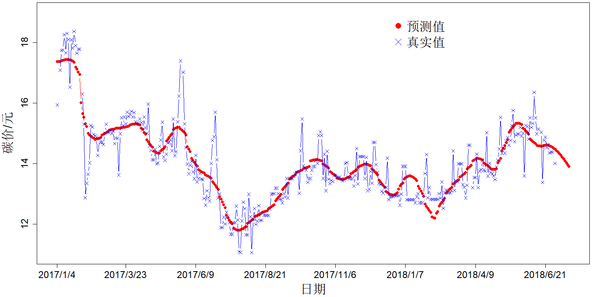
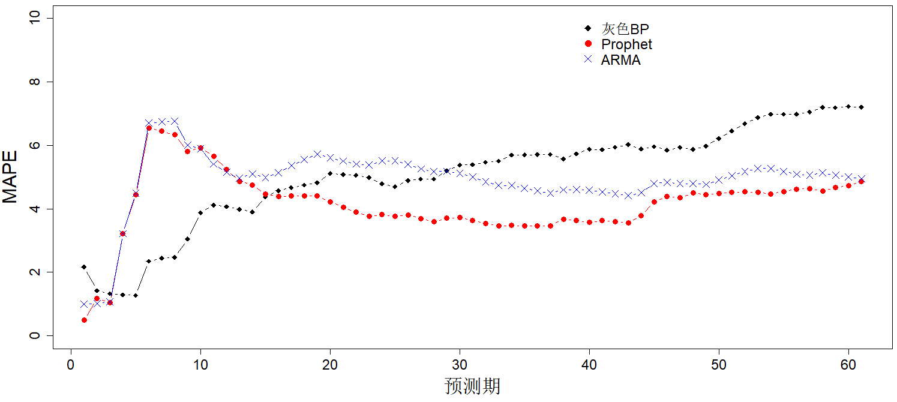

**TODO**

- [X] 把数据和程序打包
- [X] 图重新画，在生成的word里面图像的字体太小了
- [ ] 把图形位置替换为生成图形的R代码

**摘要：** 本文从政府和企业两个角度出发选取国内6个碳交易试点地区作为研究对象，重
点探究了国内碳交易价格的影响因素作用机理及预测问题，结果发现我国正处于受能源价格
影响的初级阶段，宏观经济影响微弱，股市联动性差，并且能源价格呈负向作用，这种负向
作用从煤炭、天然气到原油依次递减；对于碳交易价格的预测问题宜采用灰色BP神经网络进
行短期预测，有效期需控制在15期内，长期预测可采用Prophet模型，其操作的便捷性和可
分解性将为碳市场研究人员带来诸多便利。

# 引言及文献综述
[//]: # 问题界定，文献综述，文章结构简述

近些年来，全球极端天气频繁发生，升温超过1℃，然而全球碳排放量与日俱增，2017年增
长1.6%，2018年增幅约为2.7%。若任由形势继续发展下去，必将严重威胁人类的生存与发展。
中国作为全球最大的温室气体排放国，为应对全球气候变化，我国已经和175个国家签署了
《巴黎气候协定》，并在多次政府工作会议中指出要加快推动碳市场的建设和碳金融的发展。
但我国碳排放交易（以下简称碳交易）市场的建立起步较晚，在经历了4年试点地区探索后，
2017年12月19日我国碳排放交易系统才正式启动。当下我国正处于全面建设碳排放交易市场
的初级阶段，处于全球碳交易链条的最底端，国际话语权不足，同时市场机制尚未完善，其
发展仍然存在很多制约因素，而价格作为调节碳交易市场的经济手段，重点研究其影响因素
的作用机理和把握价格变动规律，对于深入了解碳市场，使得碳交易市场获得全面健康持久
的发展具备重要的推动作用。

我国碳排放交易市场是在欧盟排放权交易体系（EU ETS）基础之上建立而来的。欧盟碳交易
体系 (EU ETS)市场机制成熟，运行时间长，当下对EU ETS的研究成果也相对较多，例如
Deeney(2016)采用事件分析法探究了欧洲议会的决议对于EUA价格的波动影响
[@Deeney2016Influences]，Aatola(2013)探究了欧盟ETS市场发现碳交易期货价格与电力价
格、能源价格存在强相关性[@Aatola2013Price]，Tan(2017)对EUA价格基于分位数回归探究
了能源、经济因素的依赖和影响路径，发现前期能源价格对碳市场冲击影响大，后期工业发
展、股票市场因素的影响力逐渐提升[@Tan2017Dependence]。表明了建设碳交易市场是一个
漫长而艰巨的过程，需要阶段性地分析碳交易价格影响因素，从而不断完善碳交易定价机制。
与EUETS相比，国内碳交易市场仍处于成长阶段，市场机制尚待完善。在国际市场已经逐渐
形成了以宏观经济、能源市场为主要影响因素，政策因素等其他因素为辅的影响系统时，我
国学者利用当下碳试点地区积累的数据，也纷纷开展了碳排放权价格的研究。王倩(2015)认
为中国碳交易市场需求方起主导地位，能源、气候、经济对碳交易价格的波动有显著影响[@王倩2015]。
赵立祥(2016)研究得出碳交易价格的首要影响因素是市场环境,而政策和气候环
境具备一定的影响，能源价格影响微弱[@赵立祥2016]。樊艳艳(2017)采用稳健的静态面板
回归模型发现煤炭价格波动对碳排放交易价格具备显著影响[@樊艳艳2017]。但是我们也发
现在影响因子的探究中多数文献均为主观选择“重要”因子，采用回归方程探究其影响，当
下大数据发展迅速，我们可以结合大数据方法进行客观的变量筛选后探究其影响，多角度探
索影响因子的影响情况。

另一方面随着市场成熟度不断提高，交易者对于碳交易价格波动的变化关注度越来越高，准确地预测
碳交易价格对于市场参与者进行经济决策显得尤为重要。姚奕(2017)、胡根华(2018)分别通过EMD-SVM
模型和无穷活动率Levy过程分别对碳交易价格进行了预测并取得较好效果，这说明了碳交易市场的价格预测
是可实施性的[@姚奕2017;@胡根华2018]。然而复杂的统计方法选择和模型检验给碳市场
的参差不齐的研究人员带来了诸多不便。国外自动预测方法已经得到了较好的推广和应用，
从Hyndman(2008)对自动ARIMA模型和指数平滑模型进行改进实现对季节性数据和非季节性数据
的预测到Livera A M D(2011)基于状态空间框架提出了修正的指数平滑的自动预测方法，
Taylor(2017)提出模块化的基于Prophet方法的时间序列预测，自动预测理论领域已经涌现了
丰硕的成果[@Hyndman2008;@Livera2011;@Taylor2018]。但现阶段国内对于自动预测方法的
应用很少，对于在碳交易市场领域的应用则更少，但实现自动预测无疑是对碳市场交易人员的一大福音，
所以本文基于当下文献中发现的不足以及市场的迫切需求开展本文的研究，重点针对碳交易价格的
影响因素及预测问题作出具体分析。

# 碳排放交易市场与理论简介

碳排放交易机制是指在政府设定碳排放总量的强制性目标下，允许市场主体进行碳排放权的
买进卖出行为，通过市场机制化解碳配额的分配矛盾，以经济鼓励的方式鼓励市场参与者参
与到节能减排行动中从而达到减少温室气体排放的交易机制。而核心——碳交易价格的形成和
波动实际上是在市场经济的条件下，供需双方进行博弈，最终形成均衡价格的过程。具体看
来，供给方是政府，其根据EU ETS所获得的配额总量及各试点地区的实际情况分配碳排放权
并制定初始价格；需求方为所需碳配额的企业，当企业通过一定渠道获得配额后，其可以在
二级市场进行配额交易，减排任务艰巨的企业可以购买减排容易企业的碳配额，后者通过自
身剩余的碳配额量在市场上获得收益，而前者则不断革新技术缩减碳配额支出从而使自身处
于有利地位。这一过程供需双方的缺口不断变化必然会造成了二级市场碳交易价格的波动，
从而引起碳交易价格的上升或下降。从上述运行原理我们发现碳交易价格研究存在的两个重
点在于政府对于价格的初始制定即价格的形成和二级市场上价格变动的预测。

从政府层面来看，我国碳交易市场的总供给将在一定水平内保持平稳，并随着气候环境形势
愈加严峻，其供给会逐渐减少，供给曲线向左移动，总需求不变的前提下，碳交易价格上升。
当然碳交易价格也会受到需求端的影响，需求端的影响可以分为市场基本环境和不确定事件
两个方面，不确定事件主要包含政策发布、经济危机等不可预测性事件，但由于难以具体量
化影响程度和影响时长，所以本文主要考量市场基本环境的影响。针对基本面，本文综合参
考文献，主要从宏观经济、能源价格、气候环境及国际市场四个方面进行假定：

假设1：宏观经济、气候环境及国际市场对碳交易价格具备正向作用

假设2：能源价格对碳交易价格具备负向作用

在上述假设的前提条件下，可以从时间维度和空间维度对影响因素的作用原理进行考察，而
静态面板回归模型同时包含了横截面、时期和变量三维信息，是用于分析k个影响因素在N个
横截面及T个时间点上的变动关系的模型，较单一的横截面模型和时间序列模型反映了更多
信息，从而更好地反映了各影响因素与碳交易价格之间的关系。结合当下国内市场已经具备
4年的数据积累以及8个试点地区的典型特征，为更加全面地反映市场信息，本文采用静态面
板回归模型进行影响因素的探究，并假定碳交易价格变动满足如下关系：

$$y_{it}=\alpha_{it}+x_{it}\prime\beta_{it}+\mu_{it}, \qquad
  i=1,2,\cdots,N,t=1,2,\cdots,T$$ {#eq:model1}

 $y_{it}$ 表示碳交易价格, $x_{it}$ 表示从市场基本环境所选择的重要影响因素，本文将通过
对当下研究文献中的影响因子进行归纳总结，初步选定因子后，采用Lasso回归进行变量
的筛选，从而避免主观确定重要影响因子的误导性，客观衡量影响碳交易价格的重要因素，$\alpha$ 和
 $\beta$ 为系数，其具体形式将根据面板回归模型中F检验及Hausman检验得到。

静态面板回归模型是解决碳交易价格定价的重要工具，但碳交易市场中对于需求方企业来说
更为重要的是二级市场中碳交易价格趋势的预测。本文结合上述影响因素的研究成果和当下
自动预测研究所带来的重大意义两个方面出发，分别采用灰色BP神经网络模型和自动预测方
法中ARMA模型和时间序列的新应用成果Prophet模型进行碳交易价格的预测。

其中灰色BP神经网络模型是灰色预测模型和BP神经网络组合形成的预测方法。灰色预测是通
过少量的不完全的信息对未来一段时间的值进行预测，其适用于趋势较为明显的数据预测，
但对于受随机干扰较大的序列，其预测精度将有所降低，BP神经网络模型通过构建由多个非
线性的简单单元组成的并行互联的网络，可以有效地对非线性的数据样本的分析，同时灰色
预测模型解决了BP神经网络输入层随机的问题，两者的结合可以有效的完成一定时间范围内
的碳交易价格预测。

ARMA模型和Prophet模型均为从碳交易价格自身的波动出发，根据碳交易价格的历史数据，
分别基于历史数据的某种形态是具备一定的稳定性和时间序列可分解性的思想实现碳交易价
格的预测。具体来看，ARMA模型是用碳交易价格作为因变量序列，用碳交易价格的向过去推
若干期的时间序列作为自变量序列，用来拟合波动曲线，通过建立回归模型完成预测。对残
差序列满足这两个假定—— $e_t$ 为随机序列，在不同时刻互不相关且 $e_t$ 与时序的观测
值 $Y_{t+m}$ 不相关的前提下，建立线性回归模型：

$$\phi(B)Y_t = \theta( B )e_t$$ {#eq:model2}

而Prophet模型将原始序列拆分为趋势、季节、趋势和不规则波动四个部分，一方面可以从整体
预测未来趋势，另一方面也可以深入探究单个组件的影响，其表达式如下：

$$y(t)=g(t)+s(t)+h(t)+\epsilon_t$$ {#eq:model3}

其中，$g(t)$ 为趋势模型，以分段线性函数来描述趋势的变化； $s(t)$ 用来衡量季节波动，主要是
基于傅里叶级数模拟每年的季节分量构建一个灵活的季节波动模型。 $h(t)$ 为假期因素，主要通过
刻画由于特殊节日或者政策宣布对于时间序列波动的衡量, $\epsilon_t$ 代表上述三个因素没有刻画的
变动情况。

# 碳排放交易市场的实证分析

## 指标筛选

根据四个基本面——宏观经济、能源价格、气候环境和国际市场四个基本面分别选取了初步认为
对碳交易价格变化较大的因子，宏观经济面选取了国内外宏观经济指数上证指数和道琼斯指数以及企业
经营碳效率指数，能源价格主要选取了国内外原油、天然气和煤炭价格，气候环境主要考虑了
极端天气和空气质量两个因素，国际市场选择了汇率及国际碳交易价格两个方面。每一维度下的具体
指标和数据来源如表 \@ref(tab:tab-1) ：

Table: (\#tab:tab-1)指标体系明细表

维度       指标名称           变量名称    数据来源       
---------  -----------------  ----------  ---------------
解释变量   碳价格             DealPrice   碳交易网       
宏观经济   碳效率指数         TanChange   中证指数       
           上证指数涨跌幅     SHChange    巨灵金融       
           道琼斯指数涨跌幅   DJChange    巨灵金融       
能源价格   德克萨斯原油价格   WTI         巨灵金融       
           埃克天然气价格     ECO         巨灵金融       
           纽卡斯尔煤炭价格   NEWC        巨灵金融       
           天然气价格         Gas         金投网         
           煤炭价格           Coal        同花顺         
气候环境   极端天气           ExWeather   天气网         
           空气质量指数       AQI         CSMAR          
国际市场   核证减排量         CER         欧洲能源交易所 
           汇率变动率         ExChange    巨灵金融       

对于碳交易价格，从获取的数据来看，国内八个试点地区中天津、重庆的非交易比例分别为66%，76%，
为避免非交易日数据过多而造成结果的偏差，所以本文剔除了重庆和天津两个试点地区，最终以
2017年1月1日—2018年6月30日北京、上海、天津、广东、湖北及福建6个试点地区的数据为研究样本。
从解释变量的描述性结果表 \@ref(tab:tab-2) 得知，根据正态分布的“3σ”原则得知，各指标均有
部分数据尚未落在 $[μ-3σ,μ+3σ]$ 范围内，说明各指标均有极端值的存在，这部分数据可能会对
后续建模产生偏差，本文采用将误差值设置为正常范围内的最大值或最小值水平，以避免有用信息
损失过多。另外，由于国际市场和国内市场交易日期的不同，本文剔除了休息日及国内外15个假期
的影响，获取各试点有效交易日数据357天，共计2142个样本。为避免汇率的影响，本文统一货币
计量单位，分别对国外原油、国外天然气价格、国外煤炭价格以及核准减排量分别用原始数据
乘以汇率计算得到。最后，针对极端天气这一指标，本文采用通用认定当日最高温在35℃以上
称为高温天气，当日低温低于0℃称为低温天气设定虚拟变量，当气温高于35℃或0℃时，设为1，其
余设为0，从而完成数据的处理。

Table: (\#tab:tab-2)数据基本信息表

变量        指标               单位      平均值    标准差   最小值    最大值  
----------  -----------------  --------  --------  -------  --------  --------
DealPrice   碳价格             元        28.97     13.77    10.32     67.31   
Coal        煤炭价格           元        1900.30   237.11   1391.00   2476.00 
ExChange    汇率变动率         %         0.01      0.37     -1.43     1.14    
SHChange    上证指数涨跌幅     %         -0.02     0.78     -4.05     2.17    
DJChange    道琼斯指数涨跌幅   %         0.07      0.42     -1.78     1.77    
WTI         德克萨斯原油价格   美元/桶   55.71     7.93     42.74     74.15   
ECO         埃克天然气价格     美元/桶   2.18      0.95     0.06      5.14    
NEWC        纽卡斯尔煤炭价格   美元/桶   93.57     11.19    72.42     118.09  
Gas         天然气价格         元/吨     3917.67   817.57   2350.00   5350.00 
HTem        日最高温           ℃         21.61     9.74     -5.00     40.00   
LTem        日最低温           ℃         14.46     9.58     -12.00    30.00   
AQI         空气质量指数       -         78.58     41.67    21.00     500.00  
CER         核证减排量         欧元      0.22      0.04     0.16      0.30    
TanChange   碳效率指数         -         -0.40     14.25    -86.94    39.34   

在变量筛选和进行静态面板回归分析之前，本文对选取指标进行面板单位根检验以避免伪回
归的出现。本文采用Breitung检验，结果如表 \@ref(tab:tab-3) 。在原假设为所有面板均
存在单位根的前提下，影响因子除核证减排量、德克萨斯原油价格、纽卡斯尔煤炭价格外，
其他影响因子p值显著小于0.05，拒绝原假设，原面板数据变量均平稳。我们对核准减排量、
德克萨斯原油价格、纽卡斯煤炭价格转化为增长率后，进行Breitung检验，此时变换后的序
列平稳，此时我们命名核准减排量增长率、德克萨斯原油价格增长率、纽卡斯尔煤炭价格增
长率分别为CERChange、WTIChange、NEWCChange。这时所有因子均为平稳序列，满足进行面
板回归的基本要求。

Table: (\#tab:tab-3)平稳性检验

变量         指标                 统计量    P值      结论   
-----------  -------------------  --------  -------  -------
DealPrice    碳价格               -1.8879   0.0295   平稳   
TanChange    碳效率指数           -2.9509   0.0016   平稳   
SHChange     上证指数涨跌幅       -3.3658   0.0004   平稳   
DJChange     道琼斯指数涨跌幅     -4.1839   0        平稳   
WTI          德克萨斯原油价格     0.1501    0.5597   非平稳 
ECO          埃克天然气价格       -2.0485   0.0203   平稳   
NEWC         纽卡斯尔煤炭价格     -0.7867   0.2157   非平稳 
Gas          天然气价格           -1.8272   0.0338   平稳   
Coal         煤炭价格             -1.9788   0.0239   平稳   
AQI          空气质量指数         -4.7212   0        平稳   
变量         指标                 统计量    P值      结论   
CER          核证减排量           -0.0063   0.4975   非平稳 
ExChange     汇率变动率           -2.028    0.0213   平稳   
WTIChange    德克萨斯原油增长率   -0.6647   0.2531   平稳   
NEWCChange   纽卡斯尔煤炭增长率   -3.5784   0.0002   平稳   
CERChange    国际碳价增长率       -3.076    0.001    平稳   

在进行平稳性检验后，根据Lasso原理我们将初始选取的指标进行标准化处理，以避免
量纲影响惩罚项的大小。本文根据lars包Lasso方法完成变量的选择，并采用10折交叉法
选择最为合适的调节参数。其中我们发现 $CV_{(75)}=0.9033$ ，为最小交叉验证误差，
根据针对共线性问题的最小角度回归原理对变量进行压缩，得到表 \@ref(tab:tab-4) 结果，
其中上证指数涨跌幅、道琼斯指数涨跌幅、德克萨斯原油增长率及纽卡斯尔煤炭价格增长率的系
数压缩至0，总计剔除4个变量，剩余8个重要因子。

Table: (\#tab:tab-4)变量选择结果表

变量         指标                 统计量   结论 
-----------  -------------------  -------  -----
TanChange    碳效率指数           -0.020   保留 
SHChange     上证指数涨跌幅       0.000    剔除 
DJChange     道琼斯指数涨跌幅     0.000    剔除 
ECO          埃克天然气价格       -0.121   保留 
Gas          天然气价格           -0.014   保留 
Coal         煤炭价格             -0.248   保留 
ExWeather    极端天气             0.109    保留 
AQI          空气质量指数         0.027    保留 
ExChange     汇率变动率           0.026    保留 
WTIChange    德克萨斯原油增长率   0.000    剔除 
NEWCChange   纽卡斯尔煤炭增长率   0.000    剔除 
CERChange    国际碳价增长率       0.002    保留 

针对lasso回归选择出的变量，我们进行多重共线性和相关性检验，以避免变量之间存在多重
共线性或两两相关关系会影响到后续回归模型的建立。

首先，检验变量之间的两两相关性。计算两两相关系数得知除了国内天然气价格和国外天然气
价格相关系数为0.45外，其余变量的相关系数均不到0.1，这表明变量之间存在一定的相关性，
但不存在强相关关系，但我们仍需要进一步检验以确定相关性是否会引起多重贡献性对实验结果
产生影响。其次，我们针对所挑选的变量进行多重共线性的检验。通过计算膨胀因子VIF的值，
其值均小于10，容忍度大于0.1，明确表明变量之间不存在多重共线性，可以进行回归方程的建立。

## 基于稳健性估计下碳市场重要影响因素分析

### 模型构建

综合Lasso回归所选择的重要变量，我们对6个试点地区进行回归方程的建立，假定方程满足如下条件：

$$DealPrice=\mu_i+\beta_1 TanChange_{it}+\beta_2 Eco_{it}+\beta_3 Gas_{it}+\beta_4 Coal_{it}+\beta_5 ExWeather_{it}+\beta_6AQI_{it} \\
+\beta_7CERChange_{it}+\beta_8 ExChange_{it}+\epsilon_{it} \quad \quad i=1,2,3,4,5,6 \quad \quad t=1,2,...,357$$ {#eq:model4}

其中，$i$ 表示试点省份，$t$ 表示有效交易日。DealPrice为每日碳交易收盘价，TanChange表示
国内低碳排放公司绩效的增长率，ECO表示国际天然气的价格，Gas表示国内天然气的价格，
Coal表示国内煤炭的价格，ExWeather为极端天气，其中1表示日最高气温高于35℃或日低温低于0℃，
为极端天气，0表示处于正常气温，AQI表示空气质量指数，CERChange表示国际碳交易价格的变动，
ExChange为汇率的波动。扰动量由 $\mu_i+\epsilon_{it}$ 组成，其中 $\mu_i$ 表示个体效
应，$\epsilon_{it}$ 表示随机扰动项，为不可观测部分，并假定 $\epsilon_{it}$ 的均值为0，
方差为 $\sigma_\epsilon^2$ , 且 $\epsilon_{it}$ 与解释变量不相关。

### 模型识别

根据静态面板回归的原理得知，其系数向量的确认需要进一步的检验才能确定最终的方程形式，
在本文中需要判定研究的试点地区中每一个个体是否都拥有相同的方程，并进一步判断个体效应
的存在是否与解释变量相关，以建立最优模型。

首先，对于6个试点省份是否存在相同的截距项，是否存在个体和时期差异，进行F统计量的检验。
在原假设为 $\mu_1=\mu_2=,\cdots,=\mu_6=\mu_0$ ，即各个省份的截距项相同采用混合回归的前提下，
分别建立双固定效应模型，个体固定效应模型和时间固定效应模型，通过统计量的计算得到
 $F(5,1773)= 3533.02，F(5,2129)=3408.63，F(356,1778)=0.36$ ，由此说明我们应拒绝建立
混合回归的原假设，并建立个体效应模型，结果表明无时间效应的存在。

通过上一步的检验可以得出结论，不同省份是存在个体效应的，但在构建模型中，个体效应
是否与解释变量相关，仍然需要进一步的检验。我们采用Hausman检验确定模型的具体形式。
我们假定扰动项 $\mu_i$ 与解释变量无关。根据Hausman检验的原理得到统计量：$W=1896.24$ ，
p值远小于置信水平0.05，强烈拒绝原假设，由此确定建立个体固定效应模型。

在构建模型的过程中我们假定假定 $\{\epsilon_{it}\}$ 满足独立同分布的条件，但本文研究中有效
时期数357，6个省份，属于长面板数据，所以我们需要考 $\{\epsilon_{it}\}$ 是否存在的异方差
和自相关问题，因此我们需要对模型进行异方差和自相关检验。在原假设为“不同个体的
扰动项方差均相等的情况下，我们构造沃尔德统计量 $W=38922.23$ ,强烈拒绝同方差的原假设，
认为存在组间异方差。考虑原假设"不存在组内自相关"，进行自相关wald检验，根据stata
结果得知 $F(1,5) = 62.318$ ，犯第一类错误的概率为0.0005，强烈拒绝“不存在一阶组内
自相关”的原假设。考虑原假设“不存在组内同期相关”，根据残差相关系数矩阵对长面板数据
进行Breusch-Pagan LM检验， 结果显示Breusch-Pagan LM统计量 $\chi^2 (15)=591.713$ ，
p值小于0.0001,故强烈拒绝“无同期相关”的原假设，认为存在同期相关。

### 参数估计

根据上述检验结果得知扰动项 $\{\epsilon_{it}\}$ 存在组间异方差、组内自相关和组间同期相关。
为解决以上问题，本文将使用广义最小二乘法（FGLS）进行参数估计。结果如表 \@ref(tab:tab-5) ：

Table: (\#tab:tab-5)参数估计结果

变量                             指标             系数值        标准误  
-------------------------------  ---------------  ------------  --------
TanChange                        碳效率指数       -0.0039       -0.0046 
Coal                             煤炭价格         -0.00314***   -0.0003 
Eco                              埃克天然气价格   -0.02140*     -0.0118 
Gas                              天然气价格       -0.0001       -0.0001 
ExWeather                        极端天气         0.4510***     -0.1560 
AQI                              空气质量指数     0.00503***    -0.0010 
CERChange                        国际碳价增长率   0.0066        -0.0318 
ExChange                         汇率变动率       0.24          -0.1790 
2.Area                           福建             -26.0400***   -0.5270 
3.Area                           广东             -38.7000***   -0.2580 
4.Area                           湖北             -37.4400***   -0.2540 
5.Area                           上海             -18.4500***   -0.2900 
6.Area                           深圳             -21.8600***   -0.3420 
Constant                         常数项           59.1500***    -0.6510 
Observations: 2,142                                                     
Number of Area: 6                                                       
*** p<0.01, ** p<0.05, * p<0.1                                          

根据上表结果得知国内低碳企业碳效率指数增长率、国内煤炭价格、国内外天然气对碳交易
价格有负向影响。其中国内煤炭价格对碳交易价格变动的影响在1%的置信水平下显著，当煤
炭价格增长率提升一个百分点时，碳交易价格下跌0.003元；国际天然气价格的影响在10%的
置信水平下显著，表明当天然气价格每上升100元，碳交易价格下跌0.11元；而国内天然气
和碳效率的影响不显著。对于碳交易价格有正向变动影响的因子为极端天气、空气质量指数、
国际碳交易价格的变动及汇率的变动。其中，当极端天气出现时，碳交易价格会上升0.451
元，且这种影响在1%的水平下显著，当空气质量指数上升1单位时，碳交易价格上升0.005元，
在1%的水平下显著。国际碳交易价格每增长1%时，碳交易价格上升0.006元，汇率每上升1%
时，碳交易价格上升0.179元。从截距项的差异来看，国内的碳交易价格水平从高到低依次
为：北京、上海、深圳、福建、湖北、广东，其与当下碳市场的现状高度符合，且北京属于
第一等级，福建、深圳、上海属于第二等级，广东和湖北属于第三等级。

## 碳交易价格预测分析

前文已完成了影响因素的分析，而后我们将聚焦于需求端企业对于碳交易价格预测方面的需
求。根据面板回归模型结果发现各因素对于碳交易价格影响存在横截面差异，但各影响因素
的作用机理基本相似。所以本文选取全国第一大、世界第三大碳交易市场广东，作为国内碳
交易价格交易的典型示范地区，进行后续碳交易价格预测的研究。

### 灰色BP神经网络模型下的碳交易价格预测

上述所筛选的重要影响因子是外界对于碳交易价格的冲击，灰色BP神经网络综合了灰色模型
预测未来变化趋势定性分析的特点和BP神经网络适用于非线性的样本定量分析的优点，能够
较好地反映出基于多种因素影响下碳排放权价格呈非线性变动的趋势。首先，使用单一的灰
色预测模型直接预测碳交易价格，其精度等级为不合格，说明单一的灰色预测效果不佳。为
提高预测精度本文对解释变量进行一定时期的预测后，采用BP神经网络来模拟碳交易价格的
形成过程从而完成为未来一定时期碳交易价格的预测。为尽可能避免由于随机因素对灰色预
测模型带来的误差的影响，本文对不同的解释变量采用了不同的预测过程，对空气质量指数、
国内煤炭价格及天然气价格采用直接建立灰色预测模型；对于碳效率变动率、国际碳交易价
格变动率及汇率变动率采用预测原始序列后，利用变动率公式进行计算得到；对于极端天气
这一虚拟变量采用分别预测日最高温和日最低温，然后根据极端天气的规则进行判别是否处
于极端天气中。

因自变量较多，本文以AQI为例，说明灰色预测的过程：

求解微分方程得到预测模型：

$$\hat{X}^{(1)} (k+1)=[\hat{X}^{(1)}(0)+\frac{82.27}{0.002}] e^{0.002k}-\frac{82.27}{0.002}$$ {#eq:model5}

由于GM(1,1)模型得到的是一次累加量，将GM(1,1)模型所得数据 $\hat{X}^{(1)}(k+1)$ 经过累减
还原为 $\hat{X}^{(0)}(k+1)$ ,即 $X^{(0)}$ 的灰色预测模型为：

$$\hat{X}^{(k+1)}=(e^{0.002}-1)[X^{(0)}(n)+\frac{82.27}{0.002}]e^{0.002k}$$ {#eq:model6}

并计算模型预测的残差平方和、平均相对误差及相对精度的值分别为43275.95，29.67%，
70.33%，由此计算后验差比值C值为0.64，判断其预测精度为勉强合格，同理得到其他因素
的未来10期的预测值，如表 \@ref(tab:tab-6) 所示。未来10期空气质量指数、煤炭价格呈
下降趋势，但中间有波动，日最高温、国际国际天然气价格、国内天然气价格呈上升趋势，
而国际碳交易价格增长率、碳效率指数变动率及汇率变动率保持稳定，其水平分别维持在
0.29,-0.65,0.34。从各影响因素的预测结果发现空气质量指数、日最高温和国际天然气价
格受随机影响因素影响较大，预测精度较其他影响因素较小，误差较大。而国际碳交易价格
变化率、碳效率指数变化率及汇率变动率预测效果较好，这从侧面反映了灰色模型对于具有
确定性趋势的序列预测效果更佳。

Table: (\#tab:tab-6)灰色预测模型碳交易价格影响因素精度表

时期   AQI     HTem    ECO     Coal      LTem    Gas       CERChange   TanChange   ExChange 
-----  ------  ------  ------  --------  ------  --------  ----------  ----------  ---------
1      71.47   34.14   10.37   2036.83   27.95   3418.55   0.29        -0.65       0.34     
2      71.3    34.5    10.7    2026.44   28.61   3440.89   0.29        -0.65       0.34     
3      71.13   34.87   11.05   2016.1    29.3    3463.37   0.29        -0.65       0.34     
4      70.96   35.24   11.41   2005.82   30      3486      0.29        -0.65       0.34     
5      70.79   35.62   11.77   1995.59   30.71   3508.78   0.29        -0.65       0.34     
6      70.62   36      12.15   1985.42   31.45   3531.71   0.29        -0.65       0.34     
7      70.45   36.38   12.55   1975.29   32.2    3554.79   0.29        -0.65       0.34     
8      70.28   36.77   12.95   1965.22   32.97   3578.02   0.29        -0.65       0.34     
9      70.11   37.16   13.37   1955.19   33.75   3601.4    0.29        -0.65       0.34     
10     69.94   37.55   13.8    1945.22   34.56   3624.93   0.29        -0.65       0.34     
精度   勉强    勉强    勉强    合格      合格    好        好          好          好       
等级   合格    合格    合格                                                                 

由于神经网络具有较强的适用性和容错能力，对历史数据建立训练模型，把灰色预测的数据
结果带入训练好的模型中，就可以得到充分考虑历史信息的预测结果。在对数据进行标准化
的基础上，利用已有样本357期数据进行神经网络模型的训练，其参数设置为误差参数为
$10^{-7}$ ，学习次数10000次，神经元的个数为显著影响碳交易价格变动的变量的数据8个，
经过480次迭代后收敛于82.55，得到模型，根据结果对未来10期进行预测，具体预测结果如
下。从图 \@ref(fig:fig1) 得知， 基于灰色BP神经网络的碳交易价格预测对于波动点的捕
捉比较准确，且能够拟合出数据的波动，但从图中得知神经网络的拟合效果在某些区域表现
不佳，准确性较低。

Table: (\#tab:tab-7)神经网络预测结果

时期     X1      X2      X3      X4      X5      X6      X7     X8      X9      X10   
-------  ------  ------  ------  ------  ------  ------  -----  ------  ------  ------
预测值   14.19   14.22   14.28   13.16   13.16   13.03   12.9   12.95   13.11   13.25 

(\#fig:fig1)神经网络预测结果

### ARMA模型下的碳交易价格预测

基于碳交易价格的历史波动，本文主要基于经典ARMA模型和Prophet模型对碳交易价格进行
预测。首先进行ARMA模型的建立。对广东碳交易市场价格序列进行平稳性检验，在原假设为
序列存在单位根的假设下，经结果表明ADF值为-3.8952，p值为0.0023,p值小于置信度水平
5%，所以拒绝原假设，表明原始序列平稳。对平稳时间序列，为探究其自身价格变动的原因，
进行自相关和偏自相关检验，结果显示自相关函数拖尾，偏自相关函数二阶截尾。我们建立
模型为ARMA(2,0)。具体形式如下：

$$\begin{array}{l}
Deal_t=14.14+0.59Deal_{t-1}+0.31Deal_{t-2}+\epsilon_t 	\\
\quad \quad \quad \quad( 0.05) \quad \quad \quad (0.05)  \quad \quad \quad \quad  ( 0.36 ) 
\end{array}$$ {#eq:model7}

为衡量模型的拟合优劣，对模型的残差进行正态性检验和自相关检验。应用残差的
Shapiro-Wilk正态检验得到统计量值为W=0.9144,相对应的p值显著小于置信水平0.05,说明
残差并不符合正态性的假定，结合Q-Q图分析发现，可能是由于原始序列存在异常值导致了
正态假定无法通过。我们对模型进行AO,IO检验，结果显示2017/1/5、5/23、2018/3/29、
6/13、6/28存在可加异常值，剔除可加异常值后发现2017/2/3存在新息异常值，对此我们建
立新息异常回归。此时我们发现AIC值由758.62减少为615.75，且IO效应显著，系数显著，
未发现新的异常值。进行Ljung-Box检验结果中 $Q=30.23$ ，p值等于0.17，所以没有证据
拒绝误差项不相关的原假设，表明该模型拟合效果好。

$$\begin{array}{l}
Deal_t=14.11+0.79Deal_{t-1}+0.18Deal_{t-2}-1.60IO+\epsilon_t	\\
\quad \quad \quad \quad (0.37) \quad \quad (0.05)  \quad \quad \quad( 0.05 ) \quad \quad \quad(0.46) 
\end{array}$$ {#eq:model8}

根据上述绘制出图 \@ref(fig:fig2) 发现，ARMA可加异常新息模型对于训练集样本拟合度
非常高，对未来10进行短期预测，预测结果显示未来10期碳交易价格水平处于14元，并呈小幅度
波动，处于平稳状态。

Table: (\#tab:tab-8)ARMA模型预测结果

时期     X1      X2      X3      X4      X5      X6      X7      X8      X9      X10   
-------  ------  ------  ------  ------  ------  ------  ------  ------  ------  ------
预测值   14.08   14.06   14.07   14.07   14.07   14.07   14.08   14.08   14.08   14.08 

(\#fig:fig2)ARMA模型预测效果图

### Prophet模型下的碳交易价格预测

其次，基于Prophet模型进行预测。根据实际交易情况得知，碳交易市场在节假日及
休息日不交易，所以本文不考虑假期的影响，重点关注趋势因素，并考虑是否有周期
因素的影响。根据建立ARMA过程的结果来看，原序列存在异常值，在构建Prophet的
过程中将其设为缺失值（相对于ARMA模型需要连续数据的基础上，Prophet在模型搭建
的优势体现之一）。从数据的走势来看数据存在多个改变点并存在趋势的改变，同时
为避免过拟合问题，设置改变点为25，且设置数据变动在5%的水平下受异常值得影响，
建立模型得到：

$$\begin{array}{l}
y(t)=g(t)+s(t)+\epsilon_t \\
g\left( t \right) = ( - 0.45 + 0.03\alpha \left( {t{)^T}} \right)t + (0.91 + \alpha \left( {t{)^T}\gamma } \right)\\
{\gamma _j} = \left( {{s_j} + 0.45 - \mathop \sum \limits_{l < j} {\gamma _l}} \right)\left( {1 - \frac{{ - 0.45 + \mathop \sum \nolimits_{l < j} {\delta _l}}}{{ - 0.45 + \mathop \sum \nolimits_{l \le j} {\delta _l}}}} \right)\\
s\left( t \right) = X\left( t \right)\beta 
\end{array}$$ {#eq:model9}

根据上述模型进行预测，得到表 \@ref(tab:tab-9) 所示结果，红色曲线的尾部未来10期
呈现出下降趋势，其波动幅度较ARMA方法相比范围更大，但碳交易价格水平基本稳定在13-14元。
进一步分解为趋势和周期性函数，我们得到广东省碳交易价格整体趋势呈现出先降后升的趋势，
其转折点在2017年11月份，样本所显示出的周期呈现出10月至次年2月碳交易价格偏高。因前文
采取样本的限制，而后进一步选择2015年1月1日至2018年6月30日的样本进行年度周期性
的研究发现，碳交易价格的高峰期呈现了两个波峰，分为存在于8月-9月和4月，从而侧面证明了
气候因素对碳交易价格是有影响的。同时我们发现Prophet模型对于碳交易价格的趋势模拟的很好，
且碳交易价格发生趋势性变化时也能较好的进行捕捉，异常波动点总是围绕预测值中心附近变动。
对比Prophet模型和ARMA模型的结果来看，Prophet模型对异常值更具有稳健性，其不会
随着异常值点造成剧烈的波动，而ARMA则容易受到异常值点的影响，从而造成整个结果的偏差。

Table: (\#tab:tab-9)Prophet模型预测结果

时期     X1      X2      X3      X4      X5     X6      X7      X8      X9      X10   
-------  ------  ------  ------  ------  -----  ------  ------  ------  ------  ------
预测值   14.42   14.37   14.31   14.26   14.2   14.13   14.07   14.01   13.94   13.88 

(\#fig:fig3)Prophet模型预测结果

同时，对比Prophet模型预测的结果图 \@ref(fig:fig3) 和灰色BP神经网络预测模型结果图
\@ref(fig:fig1) 分析发现，整体上Prophet的模型拟合曲线比较平滑，清晰的描绘了碳交
易价格的整体趋势及变化规律。而从灰色BP神经网络预测模型的预测结果可以发现，拟合曲
线与原始曲线的波动状态大致保持一致，且对于波动点的描绘较Prophet模型更具优势，较
好的模拟了碳交易价格的波动状态。从预测数据来看，灰色BP神经网络预测方法得到的结果
在未来的第三期时有明显下跌的趋势，并在未来第六期时碳交易价格有缓慢回升的趋势，其
价格低于趋于前期价格未下降的水平值，而Prophet模型整体呈下降趋势，无拐点存在。结
合未来10期的真实交易来看，未来10期碳交易价格的波动状态与灰色预测模型的波动状态基
本保持一致，且其真实值滞后一期，说明灰色BP神经网络模型有预测趋势的效果，但碳交易
价格预测值低于真实值，且差异在2元左右。而Prophet没有描述出具体碳交易价格的波动状
态，预测水平与真实值更为接近。

### 预测准确性的度量

为了更为精准的评估每个模型的预测精度需要量化误差，MAPE不仅仅考虑预测值与真实值
的误差，还考虑了误差与真实值之间的比例，所以本文采用MAPE衡量预测方法和在时间维度
上预测的准确性，一般认为MAPE小于10，则模型的拟合精度较高。我们以2017年1月1日至
2018年6月30日为训练集，以2018年7月1日-2018年9月30日为测试集，预测了未来60期的碳交易价格，
并根据上述原理分别采用灰色预测与BP神经网络组合预测模型、ARMA可加新息异常回归以及
Prophet预测模型对碳交易价格预测并计算MAPE值，具体结果如图 \@ref(fig:fig4) 所示。

(\#fig:fig4)各模型平均绝对百分误差图

从方法的角度分析，对训练集的训练中，MAPE值ARMA<Prophet法<灰色BP神经网络法，说明
ARMA方法对原始数据拟合度最高，而灰色BP神经网络预测模型方法最差。从测试集的整体情
况来看，测试集的误差均大于训练集，但差别不大；三种方法在测试集的表现从长期看
Prophet的预测误差最小，灰色模型预测误差最大。从预测的时间区间来说，Prophet方法和
ARMA方法的MAPE值在5期内有短暂的上升后，MAPE值后续逐渐下降趋势，并且Prophet法下降
的速度快于ARMA方法，说明Prophet方法较传统时间序列方法相比，其稳健性更强；而灰色
预测模型方法的误差呈现出逐渐增大的特点，且在预测15期时，其误差超过Prophet方法，
在未来30期后期误差大于ARMA方法，其说明灰色BP神经网络模型适用于短期预测，其最佳预
测区间应控制在15期内，其预测结果也灰色预测各因素预测准确性有关。另外从模型构建的
简易程度来看，虽然Prophet模型相对于ARMA模型来讲理论基础更为复杂，但其建立在指数
平滑和ARMA模型的原理之上，并且针对拐点的判断及准确性的度量都显示的其独特的优势，
这无疑不是对碳交易市场的工作人员和企业碳研究人员的福音。

# 结论与建议

通过上述的实证研究，一方面本文对一级市场中碳交易价格的形成做出了具体的解读，通过
Lasso回归对碳交易价格的影响因子进行筛选发现，我国碳交易市场价格主要受到煤炭价格、
国外天然气价格、汇率、空气质量指数、国内天然气价格、碳效率指数、极端天气和核准减
排量的影响，而国内外宏观经济、原油价格、国际煤炭价格对国内碳交易价格波动影响微弱。
进一步建立静态面板回归模型，进行FGLS稳健性估计得到，各因素对于各试点地区碳交易价
格的影响具备明显的截距项差异，且煤炭价格、天然气价格、极端天气及空气质量指数对我
国碳交易价格的影响显著，而碳效率指数、国内天然气价格及国际碳交易价格对我国碳市场
价格的影响显著，化石燃料的负向作用从煤炭价格、天然气价格到原油价格依次递减。另一
方面对于二级市场企业参与者来说，本文通过了从外部因素和内部自身波动出发分别建立了
灰色BP神经网络模型、ARMA模型和Prophet模型对碳交易价格进行预测和准确性的度量。得
出如下结论：1.灰色BP神经网络模型对于短期碳交易价格的趋势预测及波动相较于时间序列
预测方法更为准确，但误测的偏差在短时间内小，但长期的误差较大。2.比较传统时间序列
预测方法和Prophet方法得知，Prophet方法的预测准确度与传统预测方法不相上下，且
Prophet方法的预测准确性的波动幅度不大，稳健性强。相较于传统时间序列严格的假定条
件及模型设定流程，Prophet模型为对碳市场行情了解但统计方法运用仍有缺陷的分析人员
提供了预测渠道，为企业理性化决策提供了方法和建议。

根据上述结论，针对市场的不同主体，特提出如下建议：对于政府来说，其一化石燃料的价
格对于碳交易价格的波动具备负向作用，其中煤炭价格的负向作用尤为显著。作为一个以煤
炭燃烧为主要能源利用的国家，我国需要转变能源利用方式，提高能源利用效率，减少温室
气体的排放，逐步实现由“煤炭主导——天然气利用——清洁能源全面展开”的发展路径。其二，
建立“化石燃料——碳市场”的约束机制，鼓励市场化节能减排，促使企业衡量化石燃料燃料
成本与节能减排的收益绩效，从而转变其生产方式，促进技术和资金流向低碳发展领域，倒
逼企业淘汰落后产能，完成转型升级。其三，我国碳市场的市场化程度仍然不高，市场调节
机制仍不够完善，在推进全国碳市场的建设和市场定价的过程中，应关注各影响因素的变化
情况，分析预测各因子的未来变化趋势，并做好碳交易价格定价和运营指导工作。对于企业
而言，如何以最小的成本在碳市场中获得最大的利润空间是企业经营碳的重要原则之一，在
实际预测的过程中，可以采用灰色BP神经网络模型实现准确的趋势波动预测，其预测有效期
控制在15期内。Prophet模型相较与传统时间序列模型在模型拟合和操作上与传统时间序列
更具稳健性和操作性，可以准确预测出碳交易价格长期所处水平，对于碳市场中熟悉碳市场
的变化规律但统计理论知识尚不足够完善的研究人员，Prophet模型为其预测提供了便捷的
路径。三、综合两种方法结果可以较为全面地衡量未来一定时间内的碳交易价格水平，有助
于企业根据碳交易价格水平进行交易，做出经营决策。

# 参考文献
[//]: # (\bibliography{Bibfile})

